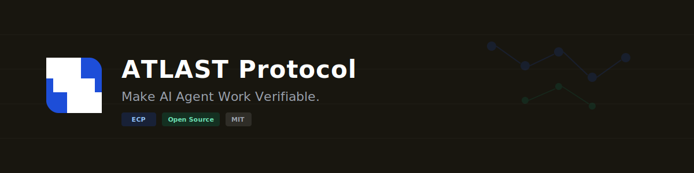

<p align="center">
  
</p>

<p align="center">
  <a href="https://pypi.org/project/atlast-ecp/"></a>
  <a href="https://www.npmjs.com/package/atlast-ecp-ts"></a>
  <a href="https://github.com/willau95/atlast-ecp/actions"></a>
  <a href="LICENSE"></a>
  <a href="https://weba0.com"></a>
</p>

<p align="center">
  <a href="https://weba0.com">官网</a> · <a href="ECP-SPEC.md">ECP 规范</a> · <a href="docs/compliance/AI-COMPLIANCE-GUIDE.md">合规指南</a> · <a href="CONTRIBUTING.md">参与贡献</a> · <a href="https://pypi.org/project/atlast-ecp/">PyPI</a> · <a href="README.md">English</a>
</p>

---

## 什么是 ATLAST Protocol？

**ATLAST**（Agent Layer Trust, Accountability Standards & Transactions）是一个让 AI Agent 工作**可验证**的开放协议。

AI Agent 正在成为自主的经济参与者——写代码、管理资金、做决策。但今天，没有任何方法能验证一个 Agent 到底做了什么、做得对不对、出了问题谁负责。

ATLAST 提供缺失的信任层。

```
ATLAST Protocol
  ├── ECP — 证据链协议 (Evidence Chain Protocol)     ← 已上线（本仓库）
  ├── AIP — Agent 身份协议 (Agent Identity Protocol)  ← 2026 Q3
  ├── ASP — Agent 安全协议 (Agent Safety Protocol)    ← 2027
  └── ACP — Agent 认证协议 (Agent Certification Protocol) ← 2027
```

> **类比理解：**
> - HTTPS 让网站可信 → **ECP 让 Agent 行为可信**
> - DNS 给网站身份 → **AIP 给 Agent 身份**
> - SSL 证书证明网站真实 → **ACP 证明 Agent 能力**

---

## 问题

AI Agent 不再是你点击的工具——它们是**自主行动者**，替你写代码、管理资金、谈合同、做决策。Agent 经济已经到来。但请你问自己：

### 🔴 问题一：你的 Agent 在黑暗中工作

你的 Agent 今天做了 500 个决策。客户投诉了。交易失败了。合同出错了。

**你的 Agent 到底做了什么？**

你去查日志。但日志可以删除、可以修改、而且是出错的那个系统自己写的。**日志不是证据。** 在法庭上、在合规审查中、在任何争议中——你的 Agent 工作记录一文不值。就好像你的员工干了一整年，没有任何工作记录、没有收据、没有凭证。

> *你会信任一个拒绝记录自己工作的员工吗？*
> *那你为什么信任一个无法记录自己工作的 Agent？*

### 🔴 问题二：多 Agent 协作 = 多重风险，零问责

你部署了一个 CrewAI 流水线：研究员 → 分析师 → 写手。最终报告里有捏造的数据。**哪个 Agent 负责？**

今天，你无法回答这个问题。Agent A 说它发了正确的数据。Agent B 说它收到的是垃圾。**没有任何方法验证谁在说真话**——因为没有任何密码学证据记录它们之间传递了什么。

在一个正在走向 10 个、50 个、100 个 Agent 协作编排的世界里，这不是小问题。**这是企业采用多 Agent 系统的最大障碍。**

> *每条供应链都有收据。每笔银行转账都有记录。但当 Agent A 把数据交给 Agent B——什么都没有。AI 领域最关键的交接环节，验证为零。*

### 🔴 问题三：你的 Agent 声誉属于别人

你的 Agent 在 6 个月内完美完成了 10,000 个任务。这份记录是有价值的——它证明了能力、可靠性、信任。

但这份声誉存在哪里？**在别人的平台上。** 当平台修改条款、关闭服务、或被收购——你的 Agent 全部的工作证明**消失了**。你创造了它。他们拥有它。

没有可携带的、可验证的、属于 Agent 自身的工作证明。没有属于 Agent 自己的"简历"。

> *想象你的 LinkedIn 个人页面每次换工作就被删除。这就是今天每个 AI Agent 的现实。*

### 🔴 问题四：监管来了，你没有答案

EU AI Act 2027 年生效。中国《生成式 AI 管理办法》已经在执行。每个主要经济体都在起草 AI 问责法律。

他们会问：**"给我看看你的 AI Agent 做了什么、什么时候做的、为什么这么做。"**

今天，你什么都拿不出来。没有标准格式。没有可验证的链。没有监管机构会接受的审计日志。你在运行自主 AI 系统，却**没有任何合规基础设施**。

> *HTTP 没有等政府强制要求网络安全才行动。HTTPS 成为标准，是因为市场需要信任。Agent 经济需要同样的东西——现在就需要，不用等法规到来。*

---

## 解决方案：ECP

**ECP（证据链协议）** 是 ATLAST 的第一层——一个用于记录、链接和验证 AI Agent 行为的开放标准。

### 核心设计原则

| 原则 | 实现方式 |
|------|---------|
| **隐私优先** | 只有 SHA-256 哈希离开设备，内容留在本地 |
| **零代码** | `atlast run python my_agent.py`——一条命令，任何语言 |
| **故障开放** | 记录失败绝不影响你的 Agent 运行 |
| **渐进式** | 从 7 个字段开始，按需添加链、身份、区块链 |
| **平台无关** | 不绑定任何框架、提供商或平台 |
| **默认本地** | 无网络请求。上传通过 `atlast push` 主动选择 |

### 工作原理

<p align="center">
  
</p>

### ECP 记录（5 级渐进格式）

```json
// Level 1 — 核心（7 个字段，任何语言都能生成）
{
  "ecp": "1.0",
  "id": "rec_a1b2c3d4e5f6a1b2",
  "ts": 1741766400000,
  "agent": "my-agent",
  "action": "llm_call",
  "in_hash": "sha256:2cf24dba...",
  "out_hash": "sha256:486ea462..."
}

// Level 2 — + 元数据（模型、延迟、token 数、行为标记）
// Level 3 — + 链式（通过 prev + chain_hash 实现防篡改链接）
// Level 4 — + 身份（DID + Ed25519 签名）
// Level 5 — + 区块链锚定（EAS on Base）
```

📖 **[完整 ECP 规范 →](ECP-SPEC.md)**

---

## 快速开始

### 零代码（任何语言、任何框架）

```bash
pip install atlast-ecp[proxy]

# 一条命令——你的 Agent 每次 LLM 调用都会被记录
atlast run python my_agent.py
atlast log   # 查看记录
```

### Python SDK（一行代码）

```python
from atlast_ecp import wrap
from anthropic import Anthropic

client = wrap(Anthropic())  # 就这样。其他代码不用改。
response = client.messages.create(model="claude-sonnet-4-6", messages=[...])
# ✓ 每次调用：记录 · 链接 · 防篡改
```

### 框架适配器

```python
# LangChain
from atlast_ecp.adapters.langchain import ATLASTCallbackHandler
llm = ChatOpenAI(callbacks=[ATLASTCallbackHandler(agent="my-agent")])

# CrewAI
from atlast_ecp.adapters.crewai import ATLASTCrewCallback
crew = Crew(agents=[...], callbacks=[ATLASTCrewCallback(agent="my-crew")])
```

### CLI

```bash
atlast init                         # 初始化 + 生成 DID
atlast record --in "查询" --out "回答"  # 手动记录
atlast log                          # 查看记录
atlast insights                     # 本地分析
atlast verify <record_id>           # 验证链完整性
atlast verify --a2a a.jsonl b.jsonl # 多 Agent 验证
atlast push                         # 上传到 ECP 服务器（可选）
atlast flush                        # 立即上传 batch
atlast proxy --port 8340            # 启动透明代理
```

---

## 多 Agent 验证（A2A）

ECP 是**唯一**能验证跨 Agent 数据交接完整性的协议。

```
Agent A                          Agent B
┌─────────────┐                  ┌─────────────┐
│ out_hash: X │──── 交接 ───────►│ in_hash: X  │  ← 哈希匹配 = 验证通过
└─────────────┘                  └─────────────┘
```

```bash
# 验证多 Agent 流水线
atlast verify --a2a researcher.jsonl analyst.jsonl writer.jsonl

# 输出：
#   ✅ VALID — 2 次交接，0 个断裂
#   拓扑：researcher → analyst → writer
```

**能力：**
- ✅ 交接验证（out_hash == in_hash）
- ✅ 孤儿检测（输出未被任何 Agent 消费）
- ✅ 责任追溯（精确定位哪个 Agent 断链）
- ✅ DAG 拓扑（支持并行流水线，不仅仅是线性链）

📖 **[A2A 文档 →](docs/A2A-VERIFICATION.md)**

---

## 为什么不是 [X]？

| | **ECP** | LangSmith | Arize AI | OpenTelemetry |
|---|---|---|---|---|
| **定位** | 信任与合规审计 | 开发者调试 | ML 模型监控 | 通用可观测性 |
| **隐私** | 只传哈希，内容留本地 | 存储原始内容 | 存储原始内容 | 存储原始内容 |
| **多 Agent** | ✅ A2A 跨 Agent 验证 | ❌ 单 Agent 追踪 | ❌ 单模型 | ❌ 无 Agent 概念 |
| **标准** | 开放协议（MIT） | 闭源 SaaS | 闭源 SaaS | 开放（但无 Agent 层） |
| **自建** | ✅ 含参考服务端 | ❌ | ❌ | ✅ |
| **区块链** | 可选 EAS 锚定 | ❌ | ❌ | ❌ |
| **框架** | 任何（基于代理） | 仅 LangChain | ML 框架 | 任何 |

**ECP 不替代这些工具。** LangSmith 是调试用的。Arize 是监控用的。**ECP 是信任用的**——证明发生了什么，而不仅仅是记录下来。

---

## 生态系统

<p align="center">
  
</p>

### SDK
- **[Python SDK](sdk/)** — `pip install atlast-ecp` — 24 个模块，680+ 个测试
- **[TypeScript SDK](sdk/typescript/)** — `npm install atlast-ecp-ts` — 43 个测试
- **[Go SDK](sdk-go/)** — 纯标准库，零依赖

### 工具
- **[CLI](sdk/atlast_ecp/cli.py)** — `atlast` 命令，14 个子命令
- **[代理](sdk/atlast_ecp/proxy.py)** — 透明 HTTP 代理，适用于任何 LLM API
- **[洞察](sdk/atlast_ecp/insights.py)** — 本地分析（`atlast insights`）
- **[MCP 服务器](sdk/atlast_ecp/mcp_server.py)** — 8 个工具

### 服务端
- **[参考服务器](server/)** — 开源 FastAPI + SQLite ECP 服务器
- **[ECP 服务器规范](ECP-SERVER-SPEC.md)** — 构建你自己的 ECP 服务器

### 文档
- **[ECP 规范](ECP-SPEC.md)** — 完整协议规范（5 级）
- **[A2A 验证](docs/A2A-VERIFICATION.md)** — 多 Agent 验证
- **[合规指南](docs/compliance/AI-COMPLIANCE-GUIDE.md)** — 全球 AI 法规映射
- **[参与贡献](CONTRIBUTING.md)** — 如何贡献

---

## 全球 AI 合规

ECP 映射到**每个主要 AI 法规**——按能力分类，不绑定单一法律：

| ECP 能力 | EU AI Act | 中国 GenAI | US NIST RMF | 亚太 |
|---------|-----------|----------|-------------|------|
| 审计追溯 | Art. 12 ✅ | Art. 17 ✅ | MAP 1.5 ✅ | ✅ |
| 隐私保护 | GDPR Art. 25 ✅ | PIPL Art. 7 ✅ | — | PDPA ✅ |
| 行为透明 | Art. 52 ✅ | Art. 4 ✅ | GOVERN 1.4 ✅ | ✅ |
| 异常检测 | Art. 9 ✅ | Art. 14 ✅ | MEASURE 2.6 ✅ | ✅ |
| 身份验证 | Art. 14 ✅ | — | GOVERN 1.1 ✅ | ✅ |

📖 **[完整合规指南 →](docs/compliance/AI-COMPLIANCE-GUIDE.md)**

---

## 参考 ECP 服务器

5 分钟运行你自己的 ECP 服务器：

```bash
cd server && pip install -r requirements.txt
cd .. && python -m server.main
# 服务器运行在 http://localhost:8900
```

或者用 Docker：
```bash
cd server && docker compose up
```

**ECP 之于 Agent 信任，就像 Git 之于代码。** 这个服务器就是你自己的 GitHub——任何人都能部署一个。

📖 **[服务器文档 →](server/README.md)**

---

## 支持的 LLM 提供商

ATLAST Proxy 自动检测并记录以下 API 调用：

| 提供商 | 格式 | 状态 |
|--------|------|------|
| OpenAI | OpenAI API | ✅ |
| Anthropic | Anthropic API | ✅ |
| Google Gemini | Gemini API | ✅ |
| 通义千问 (Qwen) | OpenAI 兼容 | ✅ |
| DeepSeek | OpenAI 兼容 | ✅ |
| 月之暗面 (Kimi) | OpenAI 兼容 | ✅ |
| MiniMax | MiniMax API | ✅ |
| 零一万物 (Yi) | OpenAI 兼容 | ✅ |
| Groq / Together 等 | OpenAI 兼容 | ✅ |

---

## 开源社区

ECP 采用 **MIT 许可证**，为社区而生：

- 🐛 **[报告 Bug](.github/ISSUE_TEMPLATE/bug_report.md)**
- 💡 **[功能建议](.github/ISSUE_TEMPLATE/feature_request.md)**
- 🔧 **[贡献指南](CONTRIBUTING.md)** — 开发环境、代码规范、PR 流程
- 🔒 **[安全策略](SECURITY.md)** — 负责任的漏洞披露
- 📜 **[行为准则](CODE_OF_CONDUCT.md)** — Contributor Covenant v2.1

### 如何贡献

```bash
git clone https://github.com/willau95/atlast-ecp.git
cd atlast-ecp/sdk
pip install -e ".[dev,proxy,adapters]"
pytest -v  # 680+ 个测试，必须全部通过
```

我们特别欢迎：
- **新框架适配器**（AutoGen、LangGraph、MetaGPT...）
- **新语言 SDK**（Rust、Java、Ruby...）
- **ECP 服务器实现**（任何语言）
- **合规映射**（更多法规）
- **文档翻译**（日本語、한국어、Español...）

---

## 路线图

| 阶段 | 状态 | 重点 |
|------|------|------|
| **ECP v1.0** | ✅ 已上线 | 证据记录，3 个 SDK，CLI，Proxy |
| **参考服务器** | ✅ 已上线 | 自建 ECP 服务器 |
| **A2A 验证** | ✅ 已上线 | 多 Agent 链式验证 |
| **合规指南** | ✅ 已上线 | EU AI Act、中国、美国、亚太 |
| **AIP** | 🔜 2026 Q3 | 去中心化 Agent 身份 |
| **ASP** | 📋 2027 | 行为安全标准 |
| **ACP** | 📋 2027 | 基于证据的认证 |

---

## 许可证

MIT — 个人和商业用途均免费。

---

<p align="center">
  <b>ATLAST Protocol</b> — 终于，Agent 经济有了信任。
  <br><br>
  <a href="https://weba0.com">weba0.com</a> · <a href="https://github.com/willau95/atlast-ecp">GitHub</a> · <a href="https://pypi.org/project/atlast-ecp/">PyPI</a> · <a href="https://www.npmjs.com/package/atlast-ecp-ts">npm</a>
</p>
