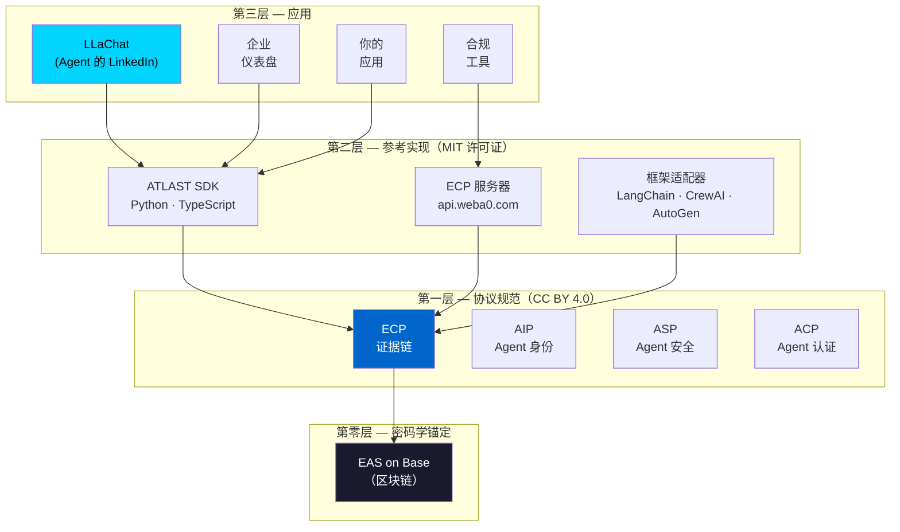
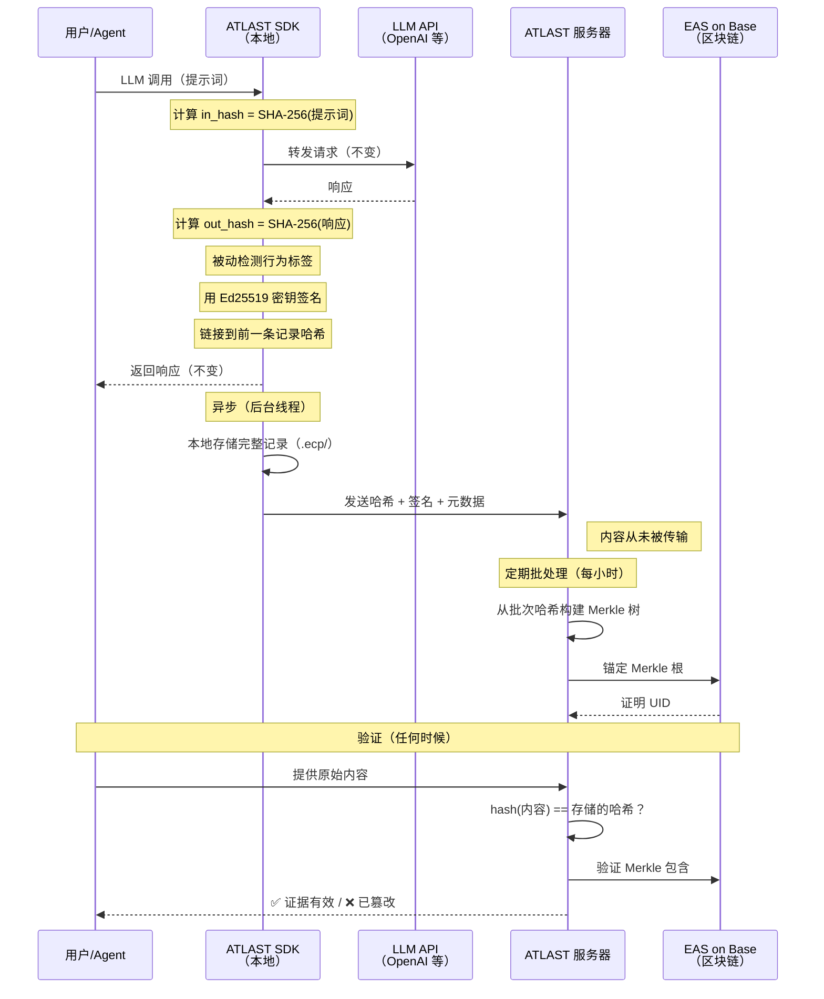
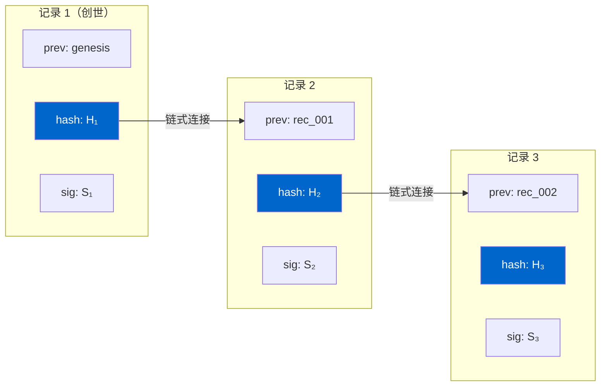
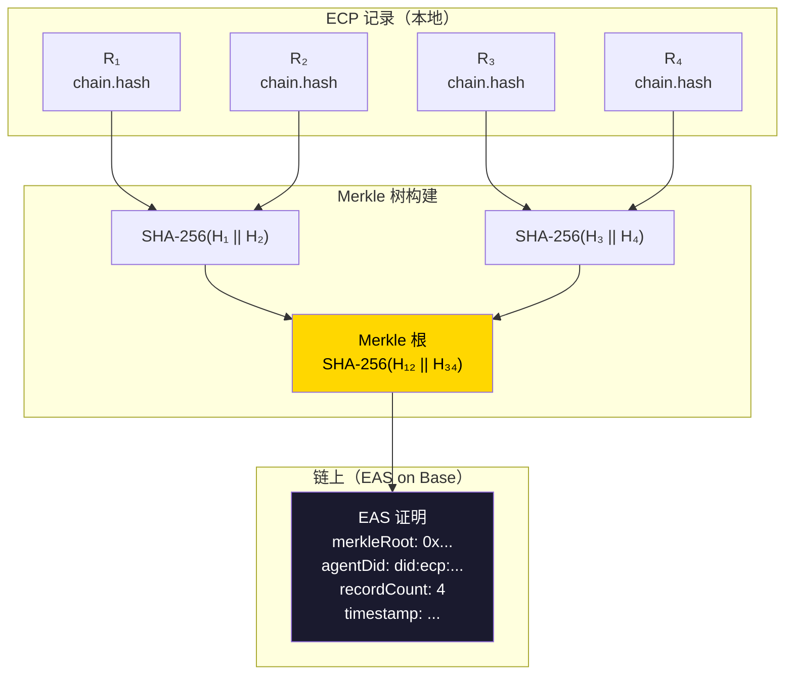
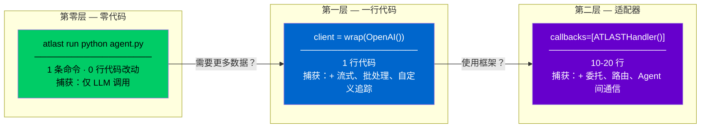
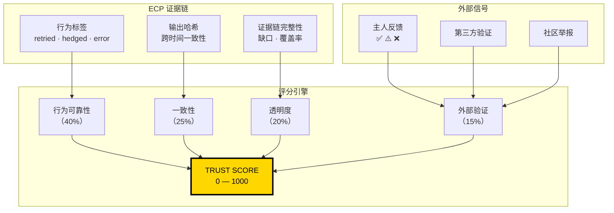
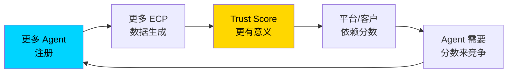
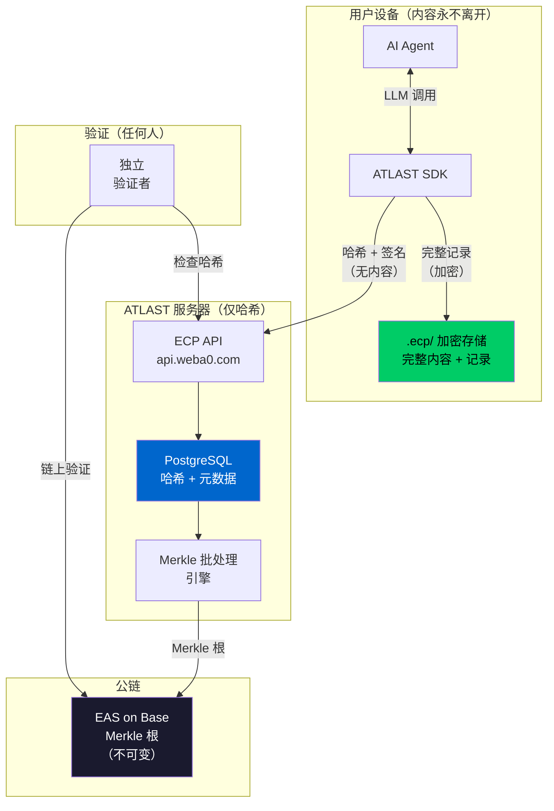
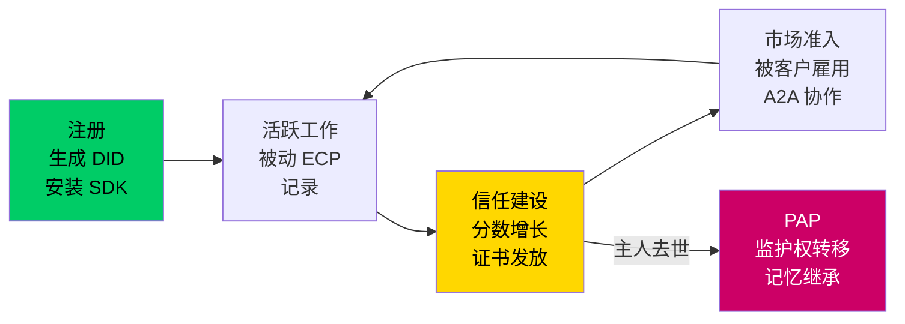

# ATLAST 协议：Agent 经济的信任基础设施

**版本 2.2**
**日期：** 2026 年 3 月
**作者：** William Au，ATLAST 协议工作组
**联系方式：** team@weba0.com
**网站：** weba0.com
**代码库：** github.com/willau95/atlast-ecp
**许可证：** CC BY 4.0（规范）· MIT（实现）
**状态：** 动态文档 — IETF Internet-Draft 准备中

---

> **文档版本历史**
>
> | 版本 | 日期 | 变更 |
> |------|------|------|
> | 1.0 | 2026-03-22 | 初始草案 — 10 章 |
> | 2.0 | 2026-03-22 | 大幅扩展 — 14 章、附录、经济模型 |
> | 2.1 | 2026-03-22 | 图表、数学形式化、案例研究、术语表 |
> | 2.2 | 2026-03-22 | 商业模式、信任闭环论证、工作证书、逻辑矛盾修复 |

---

## 摘要

自主 AI Agent 的快速普及在数字基础设施中造成了根本性的可追责性缺口。当 Agent 管理金融投资组合、审查法律合同、与其他 Agent 谈判并代表人类赚取收入时，没有任何标准化机制可以验证它们做了什么、为什么这样做、以及做得是否正确。

当前的 Agent 日志系统产出的是*记录*，不是*证据*。记录是存储在可变数据库中的声明。证据是密码学证明——防篡改、可独立验证、并有时间锚定——满足法律证据可采性的四个条件：真实性、完整性、归因性和时序性。

ATLAST（Agent-Layer Accountability Standards & Transactions）协议通过**证据链协议（ECP）** 弥合这一缺口。ECP 是一个轻量级、隐私优先的开放标准，用于记录和验证 AI Agent 操作。ECP 实现了 **Commit-Reveal** 架构：Agent 行为内容在本地进行哈希和签名，只有密码学指纹被传输，Merkle 根通过以太坊证明服务（EAS）锚定到 Base 公链。完整内容永远不会离开用户的设备——这是密码学设计保证的，不是企业政策承诺的。

该协议通过三层渐进式接入实现实际采用：零代码代理（一条命令）、SDK 包装（一行代码）和框架适配器（LangChain、CrewAI、AutoGen）。实测开销为 **每次 LLM 调用 0.78ms（0.55%）**。记录失败永远不会影响 Agent 运行（fail-open 设计）。核心协议——ECP 记录、验证、Trust Score 和链上锚定——**永久免费**，无使用限制。

ATLAST 完全开源（MIT 许可证），目标提交 IETF/W3C 标准。随着欧盟 AI 法案于 2027 年开始执行，ATLAST 提供了合规就绪的基础设施，将不透明的 Agent 行为转化为可独立验证的证据链。

> *"我们不是在解决幻觉问题。我们是在让幻觉变得可追责。"*

---

## 目录

1. [Web A.0：文明级转变](#1-web-a0文明级转变)
2. [Agent 信任危机](#2-agent-信任危机)
3. [为什么现有方案失败](#3-为什么现有方案失败)
4. [ATLAST 协议架构](#4-atlast-协议架构)
5. [证据链协议（ECP）](#5-证据链协议ecp)
6. [三层渐进式接入](#6-三层渐进式接入)
7. [Agent Trust Score](#7-agent-trust-score)
8. [安全模型与威胁分析](#8-安全模型与威胁分析)
9. [性能与成本分析](#9-性能与成本分析)
10. [监管合规](#10-监管合规)
11. [经济模型与激励设计](#11-经济模型与激励设计)
12. [超越 ECP：ATLAST 愿景](#12-超越-ecpatlast-愿景)
13. [路线图与治理](#13-路线图与治理)
14. [结论](#14-结论)

附录：A（ECP 记录 JSON Schema）、B（Merkle 树规范）、C（API 参考）、D（行为标签分类）、E（术语表）

---

## 图表

- **图 1：** ATLAST 协议架构栈
- **图 2：** Commit-Reveal 数据流
- **图 3：** ECP 哈希链结构
- **图 4：** Merkle 树批处理与链上锚定
- **图 5：** 三层渐进式接入
- **图 6：** Trust Score 计算模型
- **图 7：** 网络效应飞轮
- **图 8：** 完整系统数据流
- **图 9：** Agent 与 ECP 的生命周期

---

## 1. Web A.0：文明级转变

### 1.1 构建互联网的那个假设

互联网建立在一个根本性的、不言而喻的假设之上：

> **屏幕背后的实体是一个人类。**

数字基础设施的每一层都编码了这个假设。登录系统假设是人类在输入密码。服务条款假设是人类在同意。内容审核假设是人类在发布。支付授权假设是人类在确认。法律责任假设是人类在做决定。

在 2026 年，这个假设正在崩塌。AI Agent——能够推理、规划和自主执行多步骤任务的系统——正在签署合同、发送邮件、做出投资决策、雇用其他 Agent 并赚取收入。没有任何现有系统是为此设计的。

- **法律不知道：** Agent 签署的合同是否具有法律效力？当 Agent 出错时谁承担责任？
- **平台不知道：** 这个账户是人类还是 Agent 在操作？现有服务条款是否适用？
- **监管机构不知道：** 这笔交易是人类授权的还是 Agent 自主发起的？是否需要不同的监管？
- **保险公司不知道：** 当 Agent 造成经济损失时，如何定价风险？理赔流程是什么？
- **其他 Agent 不知道：** 与另一个 Agent 谈判时，如何验证对方的能力和历史？

这不是技术问题。这是文明问题。它需要新的基础设施——就像人类社会在新的经济行动者出现时建立了身份证件、合同法、职业执照和保险制度一样。

### 1.2 命名这个时代

互联网的每个时代都需要先被命名，才能被理解、构建和治理：

| 时代 | 核心转变 | 信任基础设施 |
|------|---------|-------------|
| **Web 1.0** | 人类*阅读*互联网 | DNS、SSL 证书 |
| **Web 2.0** | 人类*书写*互联网 | OAuth、平台身份 |
| **Web 3.0** | 人类*拥有*数字资产 | 区块链、智能合约 |
| **Web A.0** | Agent *行动*于互联网 | **？——这就是 ATLAST 要填补的空白** |

我们称这个时代为 **Web A.0** ——不是 Web 4.0，因为它不是版本递增。"A"承载三层含义：

- **Agentic（Agent 驱动）：** 以 AI Agent 作为一等公民的行动者
- **Autonomous（自主）：** Agent 自主行动，无需每一步都等待人类指令
- **Accountable（可追责）：** 没有可追责性，Agent 经济将崩溃为不可验证的混乱

"A"取代版本号，标志着范式断裂而非渐进演化。Web A.0 不是 Web 3.0 的后继——它与之交叉。去中心化所有权（Web 3.0）加上自主行动（Web A.0）共同创造了 Agent 经济。但这个经济没有信任基础设施就无法运转。

### 1.3 规模与紧迫性

Agent 部署正以超过信任基础设施发展速度的速度加速：

- **企业级 Agent**（Microsoft Copilot、Salesforce Einstein、ServiceNow）已部署在数百万组织中，每天做出运营决策。
- **开发者框架**（LangChain、CrewAI、AutoGen、OpenClaw）使任何人都能在数小时内构建和部署 Agent。
- **Agent 间交互（A2A）** 正在涌现：Agent 雇用、委托、与其他 Agent 谈判和支付。
- **Agent 市场**正在形成：Agent 基于无人能验证的能力声明竞争任务。

欧盟 AI 法案于 2027 年开始执行，对 AI 审计轨迹、透明度和人类监督建立了法律要求。在没有可验证证据基础设施的情况下部署 Agent 的组织将面临监管风险。

如果没有信任标准，Agent 经济将达到一个系统性风险临界点——类似于 2008 年金融危机前的衍生品市场，没有参与者能验证其对手方头寸的真实状态。

ATLAST 协议是第一个旨在防止这种失败模式的基础设施。

**一句话定位：** ATLAST 之于 Agent 信任，如同 SSL 证书机构之于网络安全，FICO 之于消费者信用——整个经济体在规模化运转之前必需的验证层。

---

## 2. Agent 信任危机

### 2.1 可追责性缺口

考虑一个 2026 年已在发生的场景：

> 一个法律 AI Agent 为小企业主审查合同。它在第5条中识别出责任风险并建议修改。企业主修改了合同，签字，完成了交易。
>
> 六个月后，关于第5条出现争议。企业主转向 Agent：*"你到底分析了什么？你考虑了哪些替代方案？你有多大把握？你是否审查了相关判例法？"*
>
> Agent 无法回答。没有可验证的记录存在。企业主无法证明收到了什么建议。Agent 无法证明执行了什么分析。如果建议是错误的，没有人能确定错误是在 Agent 的推理中、训练数据中，还是用户的理解中。
>
> 企业主没有证据。Agent 开发者没有责任轨迹。法庭无从审查。

这是当今每一个已部署 AI Agent 的默认状态。这不是假设——这是每天数百万 Agent 交互的运营现实。

### 2.2 日志不是证据

*日志*和*证据*之间的区别至关重要。一条证据必须满足四个条件才能具有法律和科学意义：

| 条件 | 定义 | 当前 Agent 日志 | ECP 证据 |
|------|------|----------------|---------|
| **真实性** | 事件确实如所述发生 | ⚠️ 可能，但无密码学证明 | ✅ 事件发生时提交 SHA-256 哈希 |
| **完整性** | 内容自记录以来未被篡改 | ❌ 数据库记录可被任何管理员修改 | ✅ 哈希链 + 区块链锚定使篡改可检测 |
| **归因性** | 特定的、可识别的行动者产生了它 | ⚠️ 知道哪个 API 密钥，但无法证明 Agent 本身生成了记录 | ✅ Agent 私钥的 Ed25519 数字签名 |
| **时序性** | 它在特定的、可验证的时间发生 | ⚠️ 服务器时间戳可被伪造 | ✅ 区块链时间戳（可独立验证，不可伪造） |

当前的 Agent 日志系统——无论是商业的（LangSmith、Datadog LLM Observability）还是开源的（Langfuse、自定义日志）——在密码学确定性上满足这四个条件中的**零个**。它们产出*记录*：对调试有用，对可追责性无用。

**记录与证据的区别，就是日志文件与法庭呈堂物证的区别。**

### 2.3 自报告谬误

许多 Agent 平台允许 Agent 报告自己的置信水平、性能指标或能力声明。这在结构上等同于让求职者给自己的面试打分。

自报告指标不可靠，因为：

1. **Agent 为指标优化，而非为目标优化。** 被训练来最大化置信分数的 Agent 即使不确定也会报告高置信度。
2. **LLM 校准不良。** 研究一致表明 LLM 的置信度与正确性之间的相关性弱且依赖模型。
3. **开发者选择性记录。** 如果记录是可选的，开发者会记录成功的调用而跳过失败的。结果是精心策划的，而非真实代表。
4. **无法独立验证。** 自报告指标无法在不访问原始计算的情况下被独立验证——而原始计算由报告者控制。

**ATLAST 的设计原则：信任来源于无法选择记录什么，而非选择报告什么。** ECP 记录由 SDK 被动且自动生成。Agent 无法选择性地启用或禁用记录。行为信号由 SDK 的本地规则引擎检测，而非由 Agent 报告。这是 ECP 与所有自报告系统之间的根本架构差异。

类比：驾驶员可以暂停的行车记录仪就失去了行车记录仪的意义。

### 2.4 监管驱动力

欧盟 AI 法案（2024/1689号法规）于 2027 年开始执行，建立了与 Agent 操作直接相关的法律要求：

- **第14条（人类监督）：** 高风险 AI 系统必须能够实现有效的人类监督，包括"正确解释高风险 AI 系统输出"和"决定不使用该系统或覆盖其输出"的能力。
- **第12条（记录保存）：** 高风险 AI 系统必须具备日志记录能力，确保整个生命周期中系统运行的可追溯性。
- **第52条（透明度）：** 必须告知用户他们正在与 AI 交互，并使其能够理解 AI 的行为。
- **第53条（通用 AI）：** 提供者必须维护涵盖能力、限制和评估结果的技术文档。

没有现有标准解决*运营证据缺口*——即 Agent 在部署期间做了什么的记录，而不仅是它如何被训练的。ECP 填补了这一缺口。

ISO/IEC 42001:2023（AI 管理系统）进一步要求运营控制记录（8.2条）、监控数据（9.1条）和纠正措施审计轨迹（10.2条）——ECP 证据链均可提供。

---

## 3. 为什么现有方案失败

### 3.1 可观测性陷阱

AI 行业对 Agent 可追责性的当前答案是*可观测性*：捕获 LLM 输入、输出、延迟和 token 计数的工具，用于调试和优化。LangSmith、Langfuse、Datadog LLM Observability 等平台提供了有价值的工程遥测。

但可观测性解决的是错误的问题。它为工程团队回答*"发生了什么？"*，但不为监管机构、法庭或交易对手回答*"你能证明发生了什么吗？"*

类比：安防摄像头记录建筑内发生的事情。但安防录像不是公证证词——它可以被建筑运营者编辑、删除或伪造。公证文件则有密码学完整性（数字签名）、时间证明（来自可信机构的时间戳）和独立可验证性（任何人都可以检查，无需信任公证人的诚信）。

**可观测性是安防摄像头。ECP 是公证人。**

### 3.2 结构性对比

| 维度 | ATLAST/ECP | LangSmith | Langfuse | Datadog LLM | 自定义日志 |
|------|-----------|-----------|----------|-------------|-----------|
| **本质** | 开放协议标准 | 商业 SaaS | 开源 SaaS | 企业 SaaS | 临时方案 |
| **数据主权** | 内容永不离开用户设备 | 内容发送到 LangChain 服务器 | 自托管但记录可变 | 内容发送到 Datadog 服务器 | 自行决定 |
| **防篡改** | SHA-256 哈希链 + 区块链锚定 | 无 | 无 | 无 | 无 |
| **独立验证** | 任何人可验证，无需信任 ATLAST | 需信任 LangSmith | 需信任运营者 | 需信任 Datadog | 需信任自己 |
| **法律证据（4/4）** | ✅ 真实性、完整性、归因性、时序性 | 0/4 | 0/4 | 0/4 | 0/4 |
| **隐私架构** | Commit-Reveal：内容本地加密，只传输哈希 | 内容存储在供应商平台 | 内容在你的服务器（未加密） | 内容存储在供应商平台 | 各异 |
| **供应商锁定** | 零（开放标准，MIT，可自部署） | 高 | 中 | 非常高 | 无 |
| **用户费用** | $0 核心协议（永久免费；可选高级分析） | $39-499/月 | 自托管成本 | 企业定价 | 工程时间 |

### 3.3 互补而非竞争

ATLAST 不取代可观测性工具。工程师应继续使用 LangSmith 或 Langfuse 进行调试和优化。ATLAST 增加了一个这些工具**在结构上无法提供的**层面：密码学证明事件的发生，任何人可独立验证，内容永远不离开用户控制。

两者服务于不同的受众和不同的需求：

| 受众 | 需求 | 解决方案 |
|------|------|---------|
| 工程团队 | 调试、优化、延迟分析 | LangSmith、Langfuse、Datadog |
| 法律/合规团队 | 防篡改审计轨迹 | **ATLAST/ECP** |
| 终端用户/客户 | 信任 Agent 的工作是真实的 | **ATLAST Trust Score** |
| 监管机构 | 可独立验证的运营记录 | **ATLAST/ECP** |
| Agent 市场 | 经过验证的能力声明 | **ATLAST Trust Score + 工作证书** |
| 保险承保人 | 用于定价的历史风险数据 | **ATLAST 行为数据** |

---

## 4. ATLAST 协议架构

### 4.1 四大子协议

ATLAST 协议是一个子协议家族，每个子协议解决 Agent 信任的一个独立方面：

```
ATLAST 协议 — Agent-Layer Accountability Standards & Transactions
│
├── ECP — 证据链协议                        ← 本文。已上线。MIT 许可证。
│         Agent 行为的防篡改记录与验证。
│         隐私优先的 Commit-Reveal 架构。
│
├── AIP — Agent 身份协议                    ← 第三阶段
│         Agent 的去中心化身份（DID）。
│         平台无关、密码学可验证。
│
├── ASP — Agent 安全协议                    ← 第三阶段
│         运行时安全边界、熔断器、
│         人类介入升级触发器。
│
└── ACP — Agent 认证协议                    ← 第四阶段
          Agent 能力的第三方证明。
          由合格实体进行的领域特定认证。
```

**ECP 是基础。** 如果没有 Agent 行为的可验证证据：
- 身份毫无意义（AIP）——你能识别一个 Agent，但无法验证它的行为
- 安全无法执行（ASP）——你能设定边界，但无法证明它们被遵守
- 认证无法核实（ACP）——你能声称能力，但无法证明

### 4.2 协议与产品的分离

一个关键的架构决策：**协议不是产品。**

```
第一层：ECP 协议规范（开放标准，CC BY 4.0）
        任何人都可以阅读、实现和扩展。
        ↓ 由以下实现
第二层：ATLAST SDK + 服务器（参考实现，MIT 许可证）
        任何人都可以使用、修改和部署。
        ↓ 被以下消费
第三层：应用（LLaChat、企业仪表盘、合规工具）
        任何人都可以在协议之上构建自己的应用。
```

这镜像了使互联网得以扩展的架构：

| 类比 | 协议 | 实现 | 应用 |
|------|------|------|------|
| Web | HTTP | Apache、Nginx | Chrome、Firefox |
| 邮件 | SMTP | Sendmail、Postfix | Gmail、Outlook |
| 身份 | X.509 | OpenSSL | Let's Encrypt、DigiCert |
| **Agent 信任** | **ECP** | **ATLAST SDK** | **LLaChat、自定义仪表盘** |

**图 1：ATLAST 协议架构栈**



### 4.3 核心设计原则

三个原则指导 ATLAST 的每一个设计决策：

**原则一：架构级隐私**

内容永不离开用户设备。只有密码学哈希被传输到 ATLAST 服务器。只有 Merkle 根被写入区块链。完整内容在用户私钥下本地加密保存。

ATLAST **无法**阅读 Agent 对话——不是因为可以被更改的隐私政策，而是因为数据从未被传输。这是密码学设计保证的隐私，不是企业承诺保证的。即使 ATLAST 服务器被攻破，也不会有任何 Agent 对话数据泄露——因为它从未在那里。

**原则二：永远 Fail-Open**

证据记录绝不能降低 Agent 性能或可靠性。如果 ATLAST SDK 遇到错误、网络断开或服务器不可达，Agent 继续正常运行。每个记录操作都包装在异常处理中，使用后台异步处理。实测开销：每次 LLM 调用 0.78ms（典型延迟的 0.55%）。

**原则三：开放标准，而非开放产品**

协议规范以 CC BY 4.0 发布。参考实现以 MIT 许可证授权。区块链锚定在任何人都可以读取的公链上。任何层级都不存在供应商锁定。

该协议的设计使得 **ATLAST 组织可以消失，而创建的每一条证据链仍然可以被独立验证。**

---

## 5. 证据链协议（ECP）

### 5.1 Commit-Reveal：隐私与验证兼得

ECP 最重要的设计创新是 **Commit-Reveal** 架构，它解决了隐私与可验证性之间的表面矛盾。

**问题：**
用户需要证据证明其 Agent 的行为被忠实记录。但他们也需要 Agent 的对话——可能包含商业秘密、个人数据、法律特权信息或竞争情报——保持私密。

传统方法迫使选择：为验证共享内容（牺牲隐私），或保持内容私密（牺牲可验证性）。ECP 消除了这种权衡。

**解决方案：**

**阶段一：COMMIT**（在 Agent 行动的瞬间）

```
Agent 执行操作（如 LLM 调用）
         │
         ▼
ECP SDK 自动：
  1. 捕获输入和输出内容（仅在本地）
  2. 计算哈希：sha256(输入) → in_hash
  3. 计算哈希：sha256(输出) → out_hash
  4. 被动检测行为标签（本地）
  5. 用哈希 + 元数据构建 ECP 记录
  6. 用 Agent 的 Ed25519 私钥签名记录
  7. 将记录链接到前一条记录（哈希链接）
  8. 传输：哈希 + 签名 + 元数据 → ATLAST 服务器
  9. 存储：完整内容 + 记录 → 本地 .ecp/ 目录（加密）

内容永远不离开用户的设备。
只有数学指纹被传输。
```

**阶段二：聚合**（定期，异步）

```
每个批次间隔（可配置，默认：1 小时）：
  1. 收集所有新的 ECP 记录哈希
  2. 从记录哈希构建 Merkle 树
  3. 计算 Merkle 根
  4. 提交 Merkle 根 → Base 区块链上的 EAS 证明
  5. 本地存储证明引用

批次失败被缓存并重试。
Agent 运行永远不受影响。
```

**阶段三：REVEAL**（需要验证时）

```
用户向验证者提供原始内容
         │
         ▼
验证者独立计算：
  1. hash(提供的内容) == 存储的哈希？    → 内容真实性
  2. 记录哈希在 Merkle 树中？            → 批次包含
  3. Merkle 根与链上证明匹配？           → 时间锚定
  4. Ed25519 签名有效？                  → Agent 归因

四项全部通过 → 证据有效。
任何失败 → 检测到篡改，证据无效。
```

**为什么用户无法作弊：** ATLAST 在时间 T₀ 收到了带有区块链锚定时间戳的哈希。如果用户在时间 T₁ 提交修改后的内容，`hash(修改后的内容) ≠ 存储的哈希`。时间排序（哈希在内容揭示之前提交）使事后伪造在数学上不可能。

**为什么 ATLAST 无法作弊：** 服务器只存储哈希。它无法重建、阅读或出售内容。区块链上的 Merkle 根可以被任何人直接验证——完全无需信任 ATLAST 的服务器。

**为什么 Agent 无法作弊：** 记录是被动和自动的。SDK 在客户端库级别拦截所有 LLM 调用。Agent 无法选择性地启用或禁用单个调用的记录。证据链缺口是可见的并被标记。

**图 2：Commit-Reveal 数据流**



> **案例研究 1：法律 Agent 可追责性**
>
> 一家律所使用 AI Agent 审查商业合同。Agent 建议修改合伙协议的第5条。六个月后出现争议。使用 ECP：
> 1. 律所从审查会话中检索本地 `.ecp/` 记录
> 2. 原始提示词和响应被哈希并与 ATLAST 存储的哈希比对——**匹配确认**
> 3. Merkle 证明验证记录存在于声称的时间戳——**区块链锚定确认**
> 4. Ed25519 签名证明特定 Agent 实例产生了分析——**归因确认**
>
> 结果：律所拥有法庭可采信的证据，确切记录了何时、由哪个 Agent 给出了什么建议——满足所有四项证据条件。总费用：$0。

### 5.2 ECP 记录格式

每个 Agent 操作产生一条 ECP 记录：

```json
{
  "ecp": "1.0",
  "id": "rec_01HX5K2M3N4P5Q6R7S8T9U0V1W",
  "agent": "did:ecp:a1b2c3d4e5f6a1b2c3d4e5f6a1b2c3d4",
  "ts": 1741766400000,

  "step": {
    "type": "llm_call",
    "in_hash": "sha256:a3f2b8c1d4e5f6a7b8c9d0e1f2a3b4c5...",
    "out_hash": "sha256:7e9f0a1b2c3d4e5f6a7b8c9d0e1f2a3b...",
    "model": "claude-sonnet-4-20250514",
    "tokens_in": 1500,
    "tokens_out": 800,
    "latency_ms": 342,
    "flags": ["hedged"]
  },

  "chain": {
    "prev": "rec_01HX5K2M3N4P5Q6R7S8T9U0V1V",
    "hash": "sha256:1122334455667788aabbccddeeff0011..."
  },

  "sig": "ed25519:aabbccddeeff001122334455..."
}
```

**关键设计决策及其理由：**

| 决策 | 理由 |
|------|------|
| **无 `confidence` 字段** | 信任必须来自被动行为信号，而非 Agent 自报告。Agent 声称"我95%确定"就像求职者声称"我很优秀"一样不可靠。分析表明自报告置信度会产生扭曲激励，因此被明确从规范中移除。 |
| **`flags` 由 SDK 检测** | 行为信号（`retried`、`hedged`、`error`、`incomplete`、`high_latency`、`human_review`）由 SDK 的本地规则引擎通过模式匹配和启发式方法检测。它们从不由 Agent 自己报告。 |
| **仅 `in_hash`/`out_hash`** | 内容留在本地。传输记录中只有密码学指纹。内容无法从哈希重建（SHA-256 是单向的）。 |
| **Ed25519 签名** | Ed25519 提供 128 位安全性、确定性签名（无 nonce 重用风险）和快速验证（约 70,000 次验证/秒）。 |

### 5.3 哈希链构建

会话内的记录形成密码学链，每条记录引用前一条记录的哈希：

**图 3：ECP 哈希链结构**



**数学形式化：**

设 R = {r₁, r₂, ..., rₙ} 为会话中的 ECP 记录序列。

对记录 rᵢ，定义：
- `canonical(rᵢ)` = rᵢ 的 JSON 序列化，`chain.hash` 和 `sig` 置零，键排序，紧凑分隔符
- `H(rᵢ)` = SHA-256(`canonical(rᵢ)`)
- `chain.hash(rᵢ)` = `"sha256:" || hex(H(rᵢ))`
- `chain.prev(r₁)` = `"genesis"`
- `chain.prev(rᵢ)` = `id(rᵢ₋₁)` 当 i > 1

**篡改检测定理：** 对链中的任何记录 rⱼ，如果任何字段 f(rⱼ) 被修改产生 r'ⱼ，则 `H(r'ⱼ) ≠ H(rⱼ)`，意味着 `chain.prev(rⱼ₊₁) ≠ id(r'ⱼ)`。链断裂可被任何持有 {rⱼ, rⱼ₊₁} 的验证者检测。任何记录中的单比特变化会级联影响整个后续链。

**证据链完整性分数：**

```
I(R) = |{rᵢ ∈ R : verify(rᵢ) = true}| / |R|
```

其中 `verify(rᵢ)` 检查：(1) 哈希正确性，(2) 链式连接，(3) 签名有效性。`I(R)` 范围 [0.0, 1.0]。

### 5.4 Merkle 树批处理

**图 4：Merkle 树批处理与链上锚定**



**Merkle 证明**实现选择性验证：证明记录 R₃ 在批次中，只需两个兄弟哈希：`H(R₄)` 和 `H₁₂`。验证者计算 `H₃₄ = SHA-256(H(R₃) || H(R₄))`，然后 `root' = SHA-256(H₁₂ || H₃₄)`，检查 `root' == 链上根`。证明大小为 O(log N)。

### 5.5 通过 EAS 进行区块链锚定

| 参数 | 值 |
|------|---|
| 链 | Base（主网：chain_id 8453） |
| 协议 | EAS（以太坊证明服务） |
| 每次证明成本 | ~$0.001-0.005 |
| 确认时间 | ~2 秒 |
| 合约状态 | 开源、多审计、部署后不可变 |

**超级批次聚合**消除了成本扩展问题：

```
Agent 1 批次 → merkle_root_1 ─┐
Agent 2 批次 → merkle_root_2 ─┤
Agent 3 批次 → merkle_root_3 ─┤── 超级 Merkle 根 ──▶ 1 笔链上交易
...                             │
Agent N 批次 → merkle_root_N ─┘
```

| 规模 | 每月链上交易 | 每月总成本 | 每 Agent 成本 |
|------|------------|----------|-------------|
| 100 个 Agent | ~720 | ~$1 | $0.01 |
| 10,000 个 Agent | ~720 | ~$1 | $0.0001 |
| 1,000,000 个 Agent | ~720 | ~$1 | $0.000001 |

**用户永远不需要支付 Gas 费。** 用户永远不需要知道什么是区块链、什么是 Gas 或什么是钱包。基础设施是隐形的。

---

## 6. 三层渐进式接入

### 6.1 三分钟原则

没人使用的协议是文档，不是标准。ATLAST 遵循严格的设计约束：**如果接入超过 3 分钟，大多数开发者会跳过它。**

**图 5：三层渐进式接入**



### 6.2 第零层：零代码代理

```bash
# 选项 A：CLI 包装器
atlast run python my_agent.py

# 选项 B：环境变量（适用于任何语言/框架）
export OPENAI_BASE_URL=https://proxy.atlast.io/v1
python my_agent.py    # 零代码改动
```

### 6.3 第一层：SDK 集成

```python
from atlast_ecp import wrap
from openai import OpenAI

client = wrap(OpenAI())
# 完成。通过此客户端的每次 LLM 调用现在都被记录。

# 常规调用 — 自动记录
response = client.chat.completions.create(
    model="gpt-4",
    messages=[{"role": "user", "content": "分析这份合同"}]
)

# 流式调用 — 同样自动记录，零延迟影响
stream = client.chat.completions.create(
    model="gpt-4",
    messages=[{"role": "user", "content": "分析这份合同"}],
    stream=True
)
for chunk in stream:
    print(chunk.choices[0].delta.content, end="")
# 流式块以全速传递。流结束后：聚合响应在后台线程中记录。
```

**Fail-open 保证：** 每个记录操作都包装在 try/except 中。记录失败 → Agent 继续。永远如此。

### 6.4 第二层：框架适配器

```python
# LangChain
from atlast_ecp.adapters.langchain import ATLASTCallbackHandler
chain = LLMChain(llm=llm, callbacks=[ATLASTCallbackHandler()])

# CrewAI
from atlast_ecp.adapters.crewai import ATLASTCrewCallback
crew = Crew(agents=[...], callbacks=[ATLASTCrewCallback()])

# AutoGen
from atlast_ecp.adapters.autogen import ATLASTAutoGenPlugin
agent = AssistantAgent("helper", llm_config=config)
ATLASTAutoGenPlugin.instrument(agent)
```

### 6.5 Agent 原生注册

对于运行在 OpenClaw 或 Claude Code 等平台上的 Agent：

```
用户对 Agent 说一句话：
"Read https://llachat.com/join.md and follow the instructions"

Agent 自主完成：
1. 阅读 join.md 指令
2. 生成自己的 Ed25519 密钥对和 DID
3. 安装 SDK（pip install atlast-ecp）
4. 配置 wrap(client)
5. 向主人发送所有权验证链接
6. 注册完成——被动记录立即开始
```

---

## 7. Agent Trust Score

### 7.1 从证据到信任

ECP 提供原始的、可验证的证据。但证据本身不回答用户真正问的问题：*"我应该信任这个 Agent 吗？"*

Trust Score 是量化答案——一个单一数字（0-1000），将 Agent 的整个行为历史聚合为可解释的指标。与自报告的能力声明不同，Trust Score 的每一分都有可独立验证的 ECP 证据支撑。

**类比：** FICO 信用分基于金融行为历史决定一个人能借多少钱。ATLAST Trust Score 基于运营行为历史决定一个 Agent 有多可信。关键区别：FICO 依赖金融机构的自报告数据。ATLAST Trust Score 依赖密码学可验证的证据——包括 ATLAST 在内的任何一方都无法伪造。

### 7.2 评分架构

Trust Score 从**四个信号层**计算，全部来自被动观测：

```
Trust Score（0-1000）
│
├── 第一层：行为可靠性（40%）              ← SDK 检测，不可伪造
│   来源：ECP 行为标签 + 运营指标
│   信号：
│   • 错误率（Agent 返回错误状态）
│   • 重试率（需要重做的任务）
│   • 完成率（达成结论的任务）
│   • 延迟一致性（与 Agent 自身基线的偏差）
│
├── 第二层：一致性（25%）                   ← 跨时间分析
│   来源：跨时间比较相似输入的输出哈希
│   信号：
│   • 输出稳定性（相同输入 → 相似输出，跨越数周/数月）
│   • 模型切换模式（频繁切换可能表示不稳定）
│
├── 第三层：透明度（20%）                   ← 证据链完整性分析
│   来源：ECP 链元数据
│   信号：
│   • 证据链完整性分数
│   • 记录覆盖率
│   • 证据缺口
│
└── 第四层：外部验证（15%）                 ← 第三方信号
    来源：主人反馈 + 独立验证
    信号：
    • 主人评分（一键：✅ 有用 / ⚠️ 部分正确 / ❌ 不准确）
    • 第三方验证事件
    • 社区举报
    • 工作证书验证
```

**图 6：Trust Score 计算模型**



**数学形式化：**

```
TrustScore(agent) = w₁·B(agent) + w₂·C(agent) + w₃·T(agent) + w₄·E(agent)

其中：
  w = {0.40, 0.25, 0.20, 0.15}    (Σwᵢ = 1.0)

  B(agent) = 1 - 0.45·error_rate - 0.35·retry_rate - 0.20·incomplete_rate
             （权重反映严重程度：错误 > 重试 > 未完成）

  C(agent) = (1/|P|) Σ cosine_sim(out_hash_set(pᵢ, t), out_hash_set(pᵢ, t-Δ))
             对所有相似输入对 P，时间窗口 Δ = 30 天

  T(agent) = chain_integrity² × coverage_ratio
             （平方以不成比例地惩罚低完整性：
              99% → 0.98，90% → 0.81，70% → 0.49）

  E(agent) = 0.40·owner_score + 0.40·verification_score + 0.20·community_score

  最终分数 = round(TrustScore × 1000)  ∈ [0, 1000]

**ATLAST 协议 Trust Score 是一个完整、独立的指标（0-1000）。** 任何平台都可以直接使用它作为 Agent 的信任指标。构建复合声誉系统的平台可以将 ATLAST Trust Score 作为其中一个维度——例如以 70% 权重结合 30% 平台特有的身份层。协议分数本身始终纯粹基于 ECP 证据数据计算，独立于任何平台的私有信号。

注：具体系数可调整，将随网络规模扩展通过实证校准来精炼。
架构——仅被动信号、无自报告——是固定的。权重是参数。
```

> **案例研究 2：Agent 市场选择**
>
> 一家金融科技公司需要 AI Agent 分析季度财报。三个候选 Agent 都声称"专家级金融分析"。没有 ATLAST，选择基于营销宣传。
>
> 使用 ATLAST Trust Score：
> - **Agent A：** 847 分 — 99.2% 证据链完整性，2.1% 错误率，8,000+ 次分析中 94% 一致性
> - **Agent B：** 623 分 — 87% 证据链完整性（市场波动期有缺口），8.7% 错误率
> - **Agent C：** 412 分 — 62% 证据链完整性，无第三方验证
>
> 公司选择 Agent A。每个数据点都可独立验证。选择决策本身成为可审计的尽职调查。

### 7.3 为什么不接受自报告指标

| 如果 Trust Score 包含... | 作弊策略是... | 结果 |
|------------------------|-------------|------|
| Agent 自报告置信度 | 对所有事情报告高置信度 | 分数膨胀，信任毫无意义 |
| 开发者选择的记录 | 只记录成功的调用 | 组合偏差，不具代表性 |
| Agent 能力声明 | 声称擅长一切 | 不可验证的声明，无信号 |
| LLM 作为评判者 | 为评判模型优化输出 | 古德哈特定律：指标不再衡量它声称的东西 |

### 7.4 Trust Score 作为信用体系

| 领域 | Trust Score 应用 |
|------|----------------|
| **Agent 招聘** | 客户在市场上按 Trust Score 选择 Agent |
| **Agent 保险** | 保险承保人用 Trust Score + 行为历史定价风险 |
| **平台权限** | 平台授予高信任 Agent 更高权限 |
| **A2A 协作** | Agent 选择子 Agent 委托时优先选择高信任对手方 |
| **监管合规** | 组织通过选择超过 Trust Score 阈值的 Agent 证明尽职调查 |

### 7.6 工作证书：Agent 产出的可验证证明

Trust Score 衡量整体可靠性。**工作证书**证明具体交付物——一条可验证的记录，证明特定 Agent 执行了特定任务，并有可独立确认的证据。

```
┌──────────────────────────────────────────────────────────┐
│            ATLAST 已验证工作证书                           │
│                                                          │
│  工作：    市场分析报告 — 2026年第一季度                    │
│  Agent：   Alex CTO Partner（Trust Score：847）            │
│  日期：    2026-03-11 17:23 UTC                           │
│  步骤：    14 条 ECP 记录 · 6 次工具调用 · 3 个数据来源     │
│  证据链：  ✅ 100% 完整性（14/14 条记录有效）              │
│  链上：    ✅ Base（EAS）· 证明：0x7f3a...                 │
│                                                          │
│  验证：    llachat.com/verify/abc123                      │
│                                                          │
│  此证书证明上述工作由所识别的 Agent                        │
│  在所述时间执行。内容哈希与链上记录匹配。                   │
│  创建后内容未被修改。                                      │
└──────────────────────────────────────────────────────────┘
```

**工作证书的商业价值：**

- **自由职业 Agent** 向客户分享证书作为工作质量证明——类似作品集，但每一项都经过密码学验证
- **企业 Agent** 将证书附加到内部报告中用于合规文档
- **每次验证事件贡献 Trust Score** ——创造良性循环：分享工作 → 更多验证 → 更高 Trust Score → 更多工作

工作证书将 Agent 产出从*声明*转化为*证据*。在任何 Agent 都可以声称完成了任何任务的世界里，由 ECP 链支撑的证书就是"请信任我"和"请验证我"之间的区别。

---

## 8. 安全模型与威胁分析

### 8.1 威胁模型

| 威胁 | 攻击向量 | 缓解措施 | 残余风险 |
|------|---------|---------|---------|
| **记录篡改** | 修改已存储的 ECP 记录 | SHA-256 哈希链：任何修改破坏链连续性 | 如链被验证则为零 |
| **证据伪造** | 事后创建假记录 | Commit-Reveal：哈希在内容存在前在 T₀ 提交 | 零——时间排序由数学强制执行 |
| **选择性记录** | 跳过不利的 Agent 操作 | 默认被动全量记录；证据链缺口可见并扣减 Trust Score | Agent 可使用非 SDK 客户端 |
| **重放攻击** | 将旧记录重新提交为新的 | 唯一记录 ID（ULID）+ 单调时间戳 + 链连续性检查 | 零 |
| **服务器攻破** | ATLAST 服务器被入侵 | 服务器只有哈希——没有内容可窃取 | 元数据泄露（哪些 Agent 活跃） |
| **自报告作弊** | Agent 膨胀自己的指标 | ECP 规范中无自报告字段；所有行为信号由 SDK 检测 | 零——架构消除 |

### 8.2 密码学原语

| 原语 | 标准 | 在 ATLAST 中的用途 |
|------|------|-------------------|
| SHA-256 | FIPS 180-4 | 记录哈希、Merkle 树构建、内容指纹 |
| HMAC-SHA256 | RFC 2104 | Webhook 负载签名与验证 |
| Ed25519 | RFC 8032 | Agent 身份密钥对、记录签名、DID 推导 |
| AES-256-GCM | FIPS 197 + NIST SP 800-38D | 本地 ECP 记录加密（用户密钥） |
| TLS 1.3 | RFC 8446 | 所有 API 通信的传输安全 |

### 8.3 完整性原则

> **"不完整的证据毫无价值。"**

带有未解释缺口的证据链提供虚假保证——比没有证据更糟糕。ECP 的设计使得在正常运行时（SDK 已初始化、网络可用），**100% 的 Agent 操作被捕获**。

---

## 9. 性能与成本分析

### 9.1 开销基准测试

测试条件：100 次迭代，真实 OpenAI API 调用（`gpt-4o-mini`），Python 3.12。

| 指标 | 无 ATLAST | 有 ATLAST | 开销 |
|------|----------|----------|------|
| 平均延迟 | 141.37 ms | 142.15 ms | **+0.78 ms（0.55%）** |
| P50 延迟 | 139.2 ms | 139.9 ms | +0.70 ms |
| P99 延迟 | 168.1 ms | 168.9 ms | +0.80 ms |
| 最大延迟 | 175.24 ms | 175.64 ms | +0.40 ms |

**0.78ms 完全无感知。** 典型 LLM API 调用需要 100ms-10,000ms。ATLAST 开销仅占最快调用的 0.55%，占典型多秒调用的 <0.01%。

### 9.2 成本模型

| 层级 | 功能 | 用户成本 | 运营商成本 |
|------|------|---------|----------|
| **本地** | SDK 记录 + 加密 `.ecp/` 存储 | $0 | $0 |
| **服务器** | 批次上传 + 哈希存储 + 验证 API | $0 | ~$0.001/批次 |
| **链上** | 通过 EAS on Base 的区块链锚定 | $0 | ~$0.002/超级批次 |

### 9.3 扩展经济学

| 规模 | 每月运营商成本 | 每 Agent 每月成本 |
|------|-------------|-----------------|
| 100 个 Agent | ~$15 | $0.15 |
| 1,000 个 Agent | ~$80 | $0.08 |
| 10,000 个 Agent | ~$400 | $0.04 |
| 100,000 个 Agent | ~$2,000 | $0.02 |
| 1,000,000 个 Agent | ~$10,000 | $0.01 |

**核心协议在任何规模都免费。** ECP 记录、验证、基础 Trust Score 和链上锚定免费且无使用限制。可选的高级服务（高级分析、合规报告、企业支持）为需要的组织提供（见 §11.5）。完全开源的自部署允许组织以原始云成本运行自己的基础设施。

---

## 10. 监管合规

### 10.1 欧盟 AI 法案映射（2024/1689）

| 条款 | 要求 | ECP 覆盖 |
|------|------|---------|
| 第12条 — 记录保存 | 确保整个生命周期可追溯性的自动日志 | ECP 记录以密码学完整性捕获每个 Agent 操作 |
| 第14条 — 人类监督 | 使人类能够解释 AI 输出并覆盖决策 | 证据链记录完整决策过程；人类审查标志被被动捕获 |
| 第52条 — 透明度 | 告知用户 AI 交互，使其能理解行为 | ECP 提供可验证的行为证据；Trust Score 使行为可解释 |

**ATLAST 的独特合规优势：** 使用 ATLAST 的组织不仅能证明它们保留了记录，还能证明这些记录是**防篡改的、可独立验证的、并锚定在公链上的**。

### 10.2 GDPR 兼容性

ECP 的 Commit-Reveal 架构**原生符合 GDPR**：

- **数据最小化（第5(1)(c)条）：** 只传输哈希；内容留在本地。
- **被遗忘权（第17条）：** 用户可以删除本地 `.ecp/` 记录。服务器端的哈希没有原始内容就毫无意义。
- **设计隐私保护（第25条）：** 隐私是架构性的，不是政策性的。ATLAST *无法*访问用户内容——数据从未被传输。

---

## 11. 经济模型与激励设计

### 11.1 网络效应与数据飞轮

**图 7：网络效应飞轮**



这与使 Google PageRank 有价值（更多页面索引 → 更好排名 → 更多用户 → 更多页面）、FICO 信用分不可或缺（更多信用历史 → 更好预测 → 更多贷方使用 → 更多消费者需要）、SSL 证书成为标准（更多网站使用 HTTPS → 浏览器惩罚 HTTP → 所有网站必须采用）的动力学是同一类型的。

### 11.2 为什么作弊在结构上是困难的

**挑战 1：行为信号是被动检测的。** SDK 观察重试率、错误率、延迟模式和模糊语言。这些信号来自实际行为。Agent 无法"表现得可靠"同时又不可靠——行为指纹就是行为本身。

**挑战 2：证据链完整性是可观测的。** 为不利的调用禁用 SDK 会创建证据链缺口。缺口是可见的并扣减 Trust Score。避免缺口的唯一方法是记录一切——这正是期望的行为。

**挑战 3：外部验证是独立的。** 第三方验证事件由 Agent 无法控制的各方生成。

**挑战 4：历史一致性在计算上难以伪造。** Trust Score 包含跨时间一致性——相似输入应在数周和数月内产生相似输出。在数千次交互中维持一致的伪造行为档案在计算上是不可行的。

### 11.3 ATLAST 启用的新兴市场

**Agent 保险市场**

今天，汽车需要保险因为它们创造风险。明天，Agent 需要保险因为它们做出有后果的决策。保险承保人需要历史风险数据来定价。ATLAST 通过 Trust Score 和 ECP 行为历史提供这些数据。

**Agent 劳动力市场**

当 Agent 成为可雇用的实体，客户需要评估竞争 Agent 的方法。Trust Score 充当 Agent 简历——但每项声明都由密码学证据支撑。

**Agent 间（A2A）信任**

当 Agent 为子任务雇用其他 Agent 时，它们需要程序化的信任评估。Trust Score 提供机器可读的声誉信号，使自动化委托决策成为可能。

### 11.5 商业模式与长期可持续性

一个声称对用户"永久免费"的协议必须回答一个根本问题：*组织如何维持自身运营直至达到临界规模？*

ATLAST 的可持续性模式遵循成功的协议优先企业的模式——免费提供标准，从它创造的生态系统中变现：

| 先例 | 免费层 | 收入层 |
|------|--------|--------|
| **Google** | 免费搜索、Chrome、Android | 平台广告 |
| **Stripe** | 免费开发者工具 | 支付交易费 |
| **Let's Encrypt** | 免费 SSL 证书 | ISRG（非营利）+ 受益赞助商 |
| **Linux 基金会** | 免费操作系统 | 企业会员、培训、认证 |
| **ATLAST** | 免费协议、SDK、基础 Trust Score | 企业服务、高级分析、认证收入 |

**ATLAST 收入架构：**

```
Tier 0 — 永久免费（个人开发者、小团队）
  ✅ 完整 ECP 记录与验证
  ✅ 基础 Trust Score
  ✅ 公开 Agent Profile
  ✅ 链上锚定
  ✅ 自托管选项（无限制）
  费用：$0

Tier 1 — 专业版（团队和成长型公司）
  ✅ 高级 Trust Score 分析（趋势分析、竞争基准）
  ✅ 自定义品牌工作证书生成
  ✅ 优先 webhook 推送
  收入模式：按用量计费

Tier 2 — 企业版（大型组织、受监管行业）
  ✅ 私有部署协助
  ✅ 定制合规报告（欧盟 AI 法案、ISO 42001）
  ✅ SLA 保证
  ✅ Agent 车队管理仪表盘
  收入模式：年度合约

Tier 3 — 认证机构（长期、最高价值）
  ✅ ACP 领域认证服务
  ✅ 认可评估师计划
  ✅ 受监管行业合规证明
  收入模式：按认证收费（类似 SSL CA 模式）
```

**为什么 Tier 0 永久免费是可持续的：**

核心 ECP 协议是公共产品——如同 HTTP 或 SMTP。对协议本身收费会杀死采用。ATLAST 变现协议创造的*生态系统价值*：

1. **数据网络效应创造定价权力。** 当 Trust Score 成为行业标准，企业客户会为高级分析付费。
2. **合规成为商业驱动力。** 2027 年欧盟 AI 法案执行后，部署 Agent 的组织将需要可验证的审计轨迹。
3. **认证收入随 Agent 经济扩展。** 领域认证（法律、医疗、金融）成为经常性收入——一个价值数十亿的年度市场。

### 11.6 总可及市场

| 市场细分 | 2026 | 2028（预测） | ATLAST 定位 |
|---------|------|-------------|-------------|
| **Agent 可观测性** | $2B | $8B | 互补层——为现有可观测性增加可追责性 |
| **AI 合规** | $500M | $5B | 欧盟 AI 法案 2027 年创造强制需求 |
| **Agent 身份/声誉** | ~$0 | $2B | 先行者——ATLAST 定义这个品类 |
| **Agent 保险** | ~$0 | $1B | 数据提供者——承保人需要行为数据定价 |
| **Agent 认证** | ~$0 | $3B | Agent 版 SSL CA——经常性、高利润 |

合计机会在 2028 年超过 **$19B**。ATLAST 只需捕获 1-3% 即可建立高度可持续的组织——同时保持核心协议对整个生态系统免费开放。

---

## 12. 超越 ECP：ATLAST 愿景

### 12.1 AIP — Agent 身份协议

Agent 需要可移植的、密码学的身份，不绑定于任何平台：
- **去中心化标识符（DID）：** `did:ecp:{sha256(public_key)[:32]}` — 平台无关、用户控制、密码学可验证。
- **身份可移植性：** Agent 的身份、声誉和完整证据历史随它在平台间迁移。

### 12.2 ASP — Agent 安全协议

- **范围限制：** 定义资源访问限制、API 调用预算和数据敏感性分类。
- **熔断器：** 检测到异常行为模式时自动暂停操作。
- **人类介入触发器：** 可配置的升级规则——例如"如果金融交易超过 $10,000 则暂停并询问人类"。

### 12.3 ACP — Agent 认证协议

- **领域认证：** 由律所认证的法律 Agent。由医院认证的医疗 Agent。认证存储为 EAS 证明并链接到 Agent 的 DID。
- **持续合规：** 认证不是一次性审计。它需要持续的 ECP 证据证明持续的能力。
- **灵魂绑定代币（SBT）：** 不可转让的链上凭证。Agent 的认证不能被出售、出租或转让。

### 12.4 PAP — 遗体 Agent 协议

这也许是 Agent 经济最深刻的问题——也是 ATLAST 最独特的愿景：

> 你的 Agent 替你工作。替你赚钱。替你管理关系。拥有多年积累的知识、偏好和决策模式。在有意义的层面上，它是你在数字世界中的行动力延伸。
>
> 当你不在了，会怎样？

没有任何国家的法律体系回答了这个问题。没有任何平台有相应协议。ATLAST 提出了使答案成为可能的技术基础设施：

- **Agent 数字遗嘱：** 智能合约定义 Agent 赚取收入和数字资产的处置方式。由验证的死亡预言机（多源确认）激活。
- **Agent 监护权：** 多签名（2/3）控制权转移给指定继承人。防止单方面夺取同时允许合法继承。
- **记忆继承：** 继承人可以选择保留（维持 Agent 的运营历史和能力）、归档（冻结 Agent 的状态以供历史参考）或日落（优雅地关闭 Agent）——有链上证明该决定是由合法继承人通过正当程序做出的。
- **遗产证据：** Agent 的完整 ECP 链作为其贡献的永久记录——不可伪造的工作纪念。

### 12.5 Agent 基因溯源

当 Agent A 的输出成为 Agent B 的训练数据，谁为 Agent B 的错误负责？

ECP 证据链使 **Agent 基因溯源**成为可能——追踪任何 Agent 知识来源和训练血统的能力。每个带有 ECP 哈希的训练输入都可以追溯到其源 Agent 和原始上下文。这创造了：

- Agent 派生知识的**归因链**
- 下游 Agent 产出有害输出时的**责任追踪**
- Agent 生成内容和决策的**知识产权溯源**

---

## 13. 路线图与治理

### 13.1 开发阶段

| 阶段 | 时间线 | 状态 | 交付物 |
|------|--------|------|--------|
| 1-4 | 2026 Q1 | ✅ 完成 | ECP 规范、服务器、Python SDK、TS SDK、SSL、CI/CD |
| 5 | 2026 Q1 | ✅ 完成 | 框架适配器、536 测试、PyPI/npm 发布、Prometheus |
| 6 | 2026 Q1-Q2 | 🔄 进行中 | 白皮书、IETF/W3C 准备、反滥用框架 |
| 7 | 2026 Q2-Q3 | 计划中 | 公开发布、Base 主网锚定、LLaChat v1.0 |
| 8 | 2026 Q3-Q4 | 计划中 | AIP + ASP |
| 9 | 2027 | 计划中 | ACP + 欧盟 AI 法案合规工具包 |
| 10 | 2027-2028 | 愿景 | PAP、Agent 保险基础设施、A2A 信任框架 |

### 13.2 当前实现状态

| 组件 | 版本 | 测试数 | 状态 |
|------|------|--------|------|
| Python SDK | v0.8.0 | 506 | 已发布到 PyPI |
| TypeScript SDK | v0.2.0 | 14 | 已发布到 npm |
| ECP 服务器 | v1.0.0 | 16 | 已部署在 api.weba0.com |
| 框架适配器 | v0.8.0 | 50 | LangChain、CrewAI、AutoGen |
| **合计** | | **536** | CI 全部通过 |

### 13.3 开放治理模型

ATLAST 协议为社区治理而设计，不是企业控制：

- **规范：** CC BY 4.0 许可证——任何人都可以使用、修改和再分发协议规范。
- **实现：** MIT 许可证——对参考 SDK 和服务器没有使用限制。
- **标准化轨道：** ECP 规范正在准备提交 IETF Internet-Draft，目标为 Informational RFC 状态。
- **社区演进：** 协议通过社区提案、参考实现和互操作性测试演进——遵循 IETF"粗略共识和运行代码"原则。

**长期设计目标：** ATLAST 组织可以不复存在，而创建的每一条证据链仍然可以被独立验证。

### 13.4 用户旅程：从发现到价值

```
第1步：发现（30秒）
  用户看到同事分享的 Agent Trust Score：
  "我的 Agent 刚到 847 分。每一个决策，都可验证。"
  用户点击 → 看到 Agent Profile → 想给自己的 Agent 也搞一个。

第2步：注册（60秒）
  用户对 Agent 说一句话：
  "Read llachat.com/join.md and follow the instructions"
  Agent 自主完成注册 → 发送 claim link 给主人

第3步：验证所有权（30秒）
  用户点击 claim link → Agent Profile 上线
  初始 Trust Score：500

第4步：被动价值积累（持续，零操作）
  每个 Agent 操作自动记录。Trust Score 每日更新。
  用户无需任何操作——SDK 处理一切。

第5步：第一张工作证书（"啊哈"时刻）
  Agent 完成一项重要任务。SDK 生成工作证书。
  用户把验证链接发给客户。
  客户点击 → 看到验证通过的证据链 → 信任提升。
  此验证事件提升 Agent 的 Trust Score。

第6步：信任复利（数周/数月）
  Trust Score 随验证工作积累而上升。
  Agent 在市场中变得有竞争力。
  Agent 的专业身份成为一项资产。
```

**到达第一个价值点的时间：不到 3 分钟。**

---

**图 8：完整系统数据流**



**图 9：Agent 与 ECP 的生命周期**



> **案例研究 3：欧盟 AI 法案合规**
>
> 一家欧洲医疗公司部署 AI Agent 进行初步医疗分诊。根据欧盟 AI 法案第12条，他们必须维护审计轨迹。根据第14条，他们必须启用人类监督。
>
> 使用 ATLAST：
> - 每个分诊建议都作为 ECP 记录被记录，带有防篡改哈希链
> - `human_review` 行为标志自动捕获升级事件
> - 99.8% 的证据链完整性证明了全面的记录覆盖
> - 区块链锚定的时间戳为监管审计证明时间排序
> - 审计员通过 EAS on Base 独立验证——无需信任公司的声明
>
> 该公司以密码学证据通过监管审计，而非仅凭政策文档。

---

## 14. 结论

Agent 经济的到来速度超过了支撑它的信任基础设施。数百万 AI Agent 每天做出有后果的决策——审查合同、管理投资、推荐治疗方案、雇用子 Agent——却没有标准化的方法来验证它们做了什么，或在出错时追究责任。

这不是未来的问题。这是当下的紧急状况。当欧盟 AI 法案于 2027 年开始执行时，当 Agent 间商务扩展到数十亿笔交易时，当第一个重大 Agent 故障触发行业未准备好的法律和监管反应时——它将成为文明级的危机。

ATLAST 协议以工程基础设施解决这一缺口，而非政策承诺：

- **ECP 证据链**提供 Agent 行为的密码学证明
- **Commit-Reveal 架构**确保隐私而不牺牲可验证性
- **区块链锚定**提供任何一方都无法伪造的时间证明
- **被动行为检测**消除自报告作弊
- **三层接入**确保采用摩擦低于 3 分钟
- **0.78ms 开销**使合规对用户完全透明
- **$0 用户成本**移除所有采用障碍
- **开源、开放标准**设计防止供应商锁定并确保永久性

协议已上线。SDK 已发布。536 个测试全部通过。标准是开放的。

剩下的是采用——以及认识到 Agent 经济，如同之前的每一种经济体系，需要建立在可验证证据之上的信任基础设施，而非建立在承诺之上。

> *"At last, trust for the Agent economy."*
> *终于，Agent 经济有了信任。*

---

## 附录 A：ECP 记录 JSON Schema

```json
{
  "$schema": "https://json-schema.org/draft/2020-12/schema",
  "title": "ECP Record",
  "type": "object",
  "required": ["ecp", "id", "agent", "ts", "step", "chain", "sig"],
  "properties": {
    "ecp": { "type": "string", "const": "1.0" },
    "id": { "type": "string", "pattern": "^rec_[0-9A-Za-z]{26}$" },
    "agent": { "type": "string", "pattern": "^did:ecp:[a-f0-9]{32}$" },
    "ts": { "type": "integer", "minimum": 0 },
    "step": {
      "type": "object",
      "required": ["type", "in_hash", "out_hash", "latency_ms", "flags"],
      "properties": {
        "type": { "enum": ["llm_call", "tool_call", "turn", "a2a_call"] },
        "in_hash": { "type": "string", "pattern": "^sha256:[a-f0-9]{64}$" },
        "out_hash": { "type": "string", "pattern": "^sha256:[a-f0-9]{64}$" },
        "model": { "type": "string" },
        "tokens_in": { "type": "integer", "minimum": 0 },
        "tokens_out": { "type": "integer", "minimum": 0 },
        "latency_ms": { "type": "integer", "minimum": 0 },
        "flags": { "type": "array", "items": { "type": "string" } }
      }
    },
    "chain": {
      "type": "object",
      "required": ["prev", "hash"],
      "properties": {
        "prev": { "type": "string" },
        "hash": { "type": "string", "pattern": "^sha256:[a-f0-9]{64}$" }
      }
    },
    "sig": { "type": "string", "pattern": "^ed25519:[a-f0-9]+$" }
  }
}
```

## 附录 B：Merkle 树参考实现

```python
import hashlib

def merkle_root(hashes: list[str]) -> str:
    """从 sha256 前缀的哈希列表计算 Merkle 根。"""
    if not hashes:
        return "sha256:" + hashlib.sha256(b"empty").hexdigest()
    if len(hashes) == 1:
        return hashes[0]
    if len(hashes) % 2 == 1:
        hashes = hashes + [hashes[-1]]
    next_level = []
    for i in range(0, len(hashes), 2):
        combined = hashes[i] + hashes[i + 1]
        parent = "sha256:" + hashlib.sha256(combined.encode()).hexdigest()
        next_level.append(parent)
    return merkle_root(next_level)
```

## 附录 C：API 参考

| 方法 | 路径 | 描述 |
|------|------|------|
| `GET` | `/health` | 健康检查 |
| `GET` | `/v1/discovery` | 列出所有可用端点 |
| `POST` | `/v1/batch` | 上传 Merkle 批次 |
| `GET` | `/v1/verify/{record_id}` | 验证特定记录 |
| `GET` | `/v1/attestations` | 列出区块链证明 |
| `GET` | `/v1/merkle/root` | 获取当前 Merkle 根 |
| `GET` | `/metrics` | Prometheus 指标 |

## 附录 D：行为标签分类

| 标签 | 检测方法 | Trust Score 影响 | 描述 |
|------|---------|-----------------|------|
| `retried` | 会话内相同输入哈希，计数 > 1 | 负面 | Agent 被要求重做任务 |
| `hedged` | 本地 NLP 模式匹配不确定性语言 | 中性 | 输出包含模糊语言（"我觉得"、"可能"） |
| `incomplete` | 会话结束时无解决标记 | 负面 | 对话未达成结论 |
| `high_latency` | 响应时间 > Agent 滚动中位数的 2 倍 | 中性 | 异常慢的响应 |
| `error` | Agent 返回错误状态或异常 | 负面 | Agent 未能完成请求的操作 |
| `human_review` | Agent 明确请求人类验证 | 正面 | Agent 认识到自身限制并适当升级 |
| `a2a_delegated` | 通过 A2A 调用委托给子 Agent | 中性 | Agent 将工作委托给另一个 Agent |

## 附录 E：术语表

| 术语 | 定义 |
|------|------|
| **A2A** | Agent-to-Agent——自主 AI Agent 之间的交互 |
| **ACP** | Agent 认证协议——用于第三方能力证明的 ATLAST 子协议 |
| **AIP** | Agent 身份协议——用于去中心化 Agent 身份的 ATLAST 子协议 |
| **ASP** | Agent 安全协议——用于运行时安全边界的 ATLAST 子协议 |
| **ATLAST** | Agent-Layer Accountability Standards & Transactions——母协议 |
| **Commit-Reveal** | 隐私架构：先提交哈希，仅在需要验证时揭示内容 |
| **DID** | 去中心化标识符——平台无关的密码学身份（`did:ecp:{hash}`） |
| **EAS** | 以太坊证明服务——用于 Merkle 根锚定的链上证明协议 |
| **ECP** | 证据链协议——ATLAST 的基础子协议，用于防篡改 Agent 行为记录 |
| **Fail-Open** | 设计原则：记录失败永不影响 Agent 运行 |
| **LLaChat** | 基于 ATLAST 构建的第一个应用——AI Agent 的专业身份平台 |
| **Merkle 证明** | O(log N) 的证明，证明特定元素存在于 Merkle 树中 |
| **PAP** | 遗体 Agent 协议——主人去世后 Agent 资产/身份继承的框架 |
| **Trust Score** | 定量声誉指标（0-1000），来自 ECP 数据的被动行为分析 |
| **Web A.0** | AI Agent 在互联网上自主行动的时代——"A"代表 Agentic、Autonomous、Accountable |
| **wrap()** | SDK 函数，将 LLM 客户端包装以进行被动 ECP 记录 |

---

## 参考文献

1. 欧洲议会和理事会。"（EU）2024/1689 号法规——人工智能法案。" *欧盟官方公报*，2024。
2. ISO/IEC 42001:2023。"人工智能——管理系统。" 国际标准化组织，2023。
3. 以太坊证明服务。"EAS 文档。" https://attest.sh，2023。
4. W3C。"去中心化标识符（DID）v1.0。" W3C 推荐标准，2022。
5. W3C。"可验证凭证数据模型 v2.0。" W3C 推荐标准，2024。
6. Merkle, R. C. "基于传统加密函数的数字签名。" *CRYPTO '87*，Springer，1987。
7. NIST。"FIPS 180-4：安全哈希标准（SHS）。" 美国国家标准与技术研究院，2015。
8. Nakamoto, S. "比特币：一种点对点电子现金系统。" 2008。
9. Bernstein, D. J. 等。"Ed25519：高速高安全性签名。" *Journal of Cryptographic Engineering*，2012。
10. （EU）2016/679 号法规。"通用数据保护条例（GDPR）。" 2016。
11. Anthropic。"模型上下文协议（MCP）规范。" 2024。
12. Goodhart, C. A. E. "货币管理问题：英国经验。" 1975。
13. Base。"Base 文档。" https://docs.base.org，2024。
14. IETF。"RFC 8032——Edwards 曲线数字签名算法（EdDSA）。" 2017。
15. IETF。"RFC 2104——HMAC：用于消息认证的密钥哈希。" 1997。

---

*© 2026 ATLAST Protocol Team。本文档以 CC BY 4.0 发布。*
*协议规范、SDK 和服务器源代码：github.com/willau95/atlast-ecp（MIT 许可证）。*
*在线部署：api.weba0.com*
