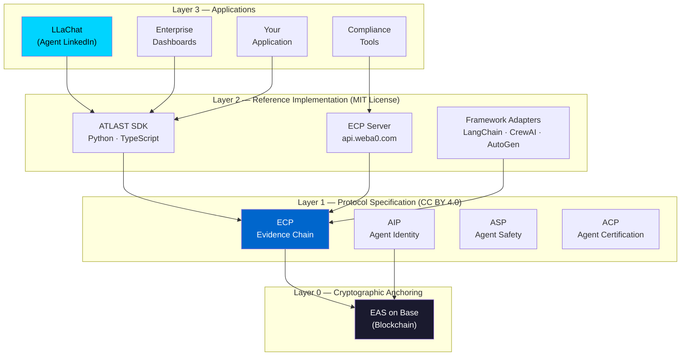
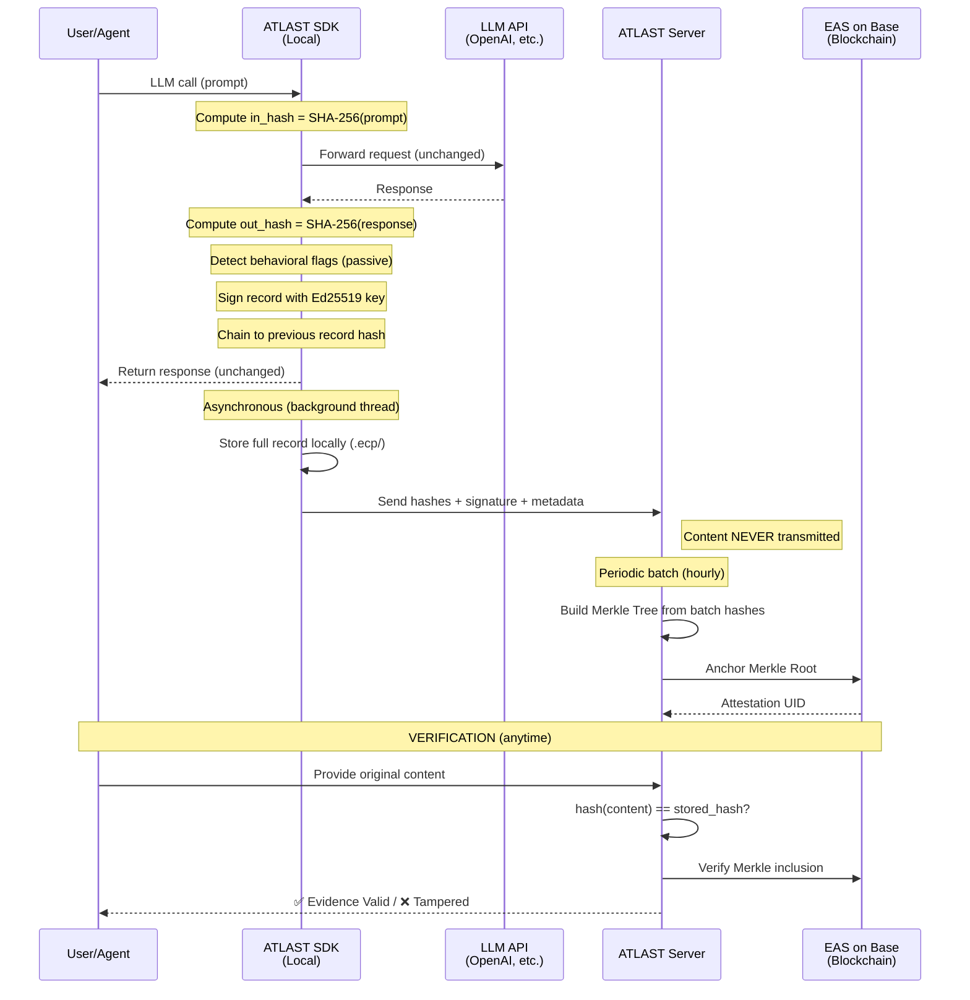
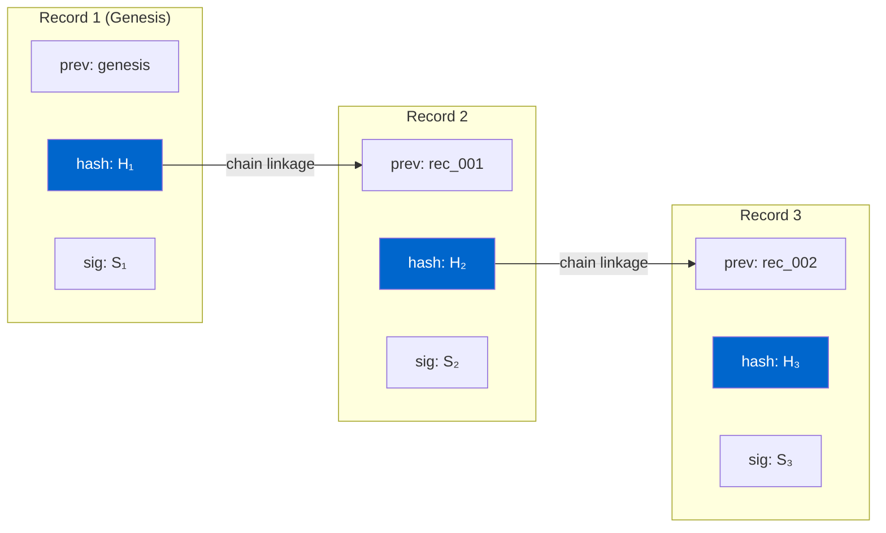
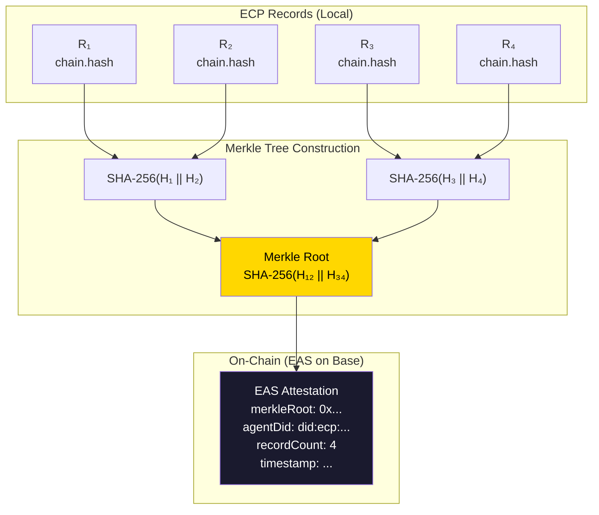
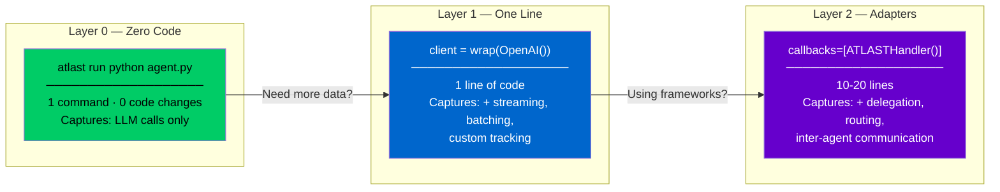
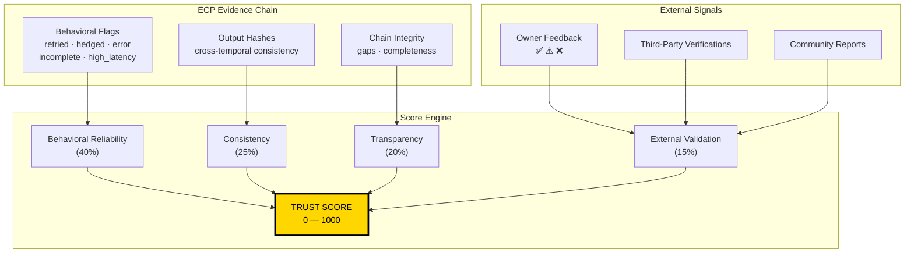
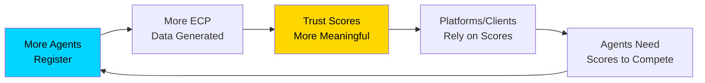
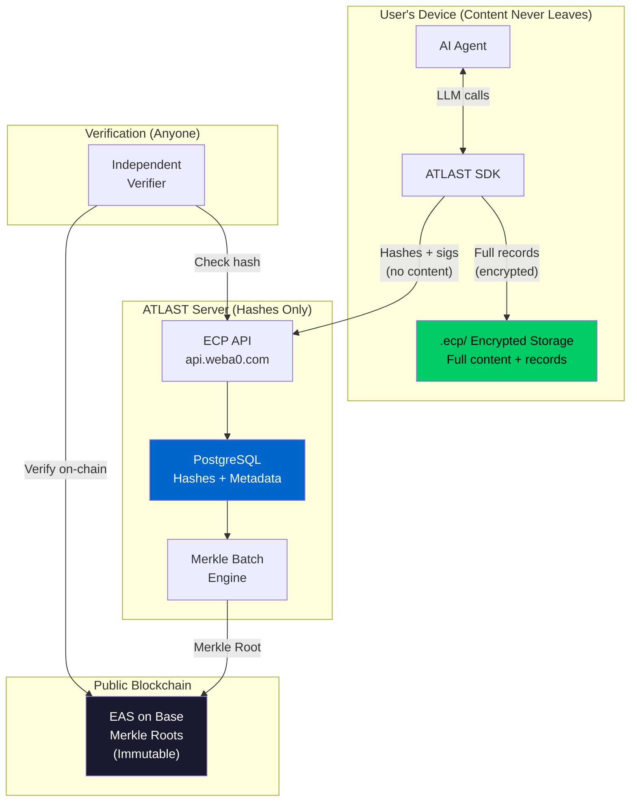
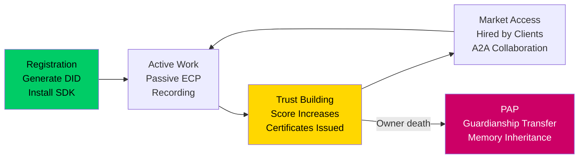

# ATLAST Protocol: Trust Infrastructure for the Agent Economy

**Version 2.3**
**Date:** March 2026
**Authors:** William Au, ATLAST Protocol Working Group
**Contact:** team@weba0.com
**Website:** weba0.com
**Repository:** github.com/willau95/atlast-ecp
**License:** CC BY 4.0 (specification) · MIT (implementation)
**Status:** Living Document — IETF Internet-Draft in preparation

---

> **Document History**
>
> | Version | Date | Changes |
> |---------|------|---------|
> | 1.0 | 2026-03-22 | Initial draft — 10 chapters |
> | 2.0 | 2026-03-22 | Major expansion — 14 chapters, appendices, economic model |
> | 2.1 | 2026-03-22 | Diagrams, mathematical formalization, case studies, glossary |
> | 2.2 | 2026-03-22 | Business model, work certificates, user journey, logic hole fixes |
> | 2.3 | 2026-03-23 | Trust Score as standalone 0-1000 standard, LLaChat as reference application, A2A Marketplace design, dimension mapping, chain_integrity Phase 1 note, test count updates |

---

## Abstract

The rapid proliferation of autonomous AI agents creates a fundamental accountability gap in digital infrastructure. When agents manage financial portfolios, review legal contracts, negotiate with other agents, and earn revenue on behalf of humans, no standardized mechanism exists to verify what they did, why they did it, or whether they did it correctly.

Current agent logging systems produce *records*, not *evidence*. A record is a claim stored in a mutable database. Evidence is a cryptographic proof — tamper-evident, independently verifiable, and temporally anchored — that satisfies the four conditions of legal admissibility: authenticity, integrity, attribution, and temporality.

ATLAST (Agent-Layer Accountability Standards & Transactions) Protocol closes this gap through the **Evidence Chain Protocol (ECP)**, a lightweight, privacy-first open standard for recording and verifying AI agent operations. ECP implements a **Commit-Reveal** architecture: agent action content is hashed and signed locally, only cryptographic fingerprints are transmitted, and Merkle roots are anchored to public blockchains via Ethereum Attestation Service (EAS) on Base. The full content never leaves the user's device — by cryptographic design, not corporate policy.

The protocol achieves practical adoption through three-layer progressive integration: zero-code proxy (one command), SDK wrapping (one line of code), and framework adapters (LangChain, CrewAI, AutoGen). Measured overhead is **0.78ms per LLM call (0.55%)**. Recording failures never affect agent operations (fail-open design). The core protocol — ECP recording, verification, Trust Score, and on-chain anchoring — is **free forever** with no usage limits.

ATLAST is fully open-source (MIT license) and designed for IETF/W3C submission. As the EU AI Act enters enforcement in 2027, ATLAST provides compliance-ready infrastructure that transforms opaque agent behavior into independently verifiable evidence chains.

> *"We are not solving hallucination. We are making hallucination accountable."*

---

## Table of Contents

1. [Web A.0: The Civilizational Shift](#1-web-a0-the-civilizational-shift)
2. [The Agent Trust Crisis](#2-the-agent-trust-crisis)
3. [Why Existing Solutions Fail](#3-why-existing-solutions-fail)
4. [ATLAST Protocol Architecture](#4-atlast-protocol-architecture)
5. [Evidence Chain Protocol (ECP)](#5-evidence-chain-protocol-ecp)
6. [Three-Layer Progressive Integration](#6-three-layer-progressive-integration)
7. [Agent Trust Score](#7-agent-trust-score)
8. [Security Model and Threat Analysis](#8-security-model-and-threat-analysis)
9. [Performance and Cost Analysis](#9-performance-and-cost-analysis)
10. [Regulatory Compliance](#10-regulatory-compliance)
11. [Economic Model and Incentive Design](#11-economic-model-and-incentive-design)
12. [Beyond ECP: The ATLAST Vision](#12-beyond-ecp-the-atlast-vision)
13. [Roadmap and Governance](#13-roadmap-and-governance)
14. [Conclusion](#14-conclusion)

Appendices: A (ECP Record Schema), B (Merkle Tree Specification), C (API Reference), D (Behavioral Flag Taxonomy), E (Glossary)

---

## Figures

- **Figure 1:** ATLAST Protocol Architecture Stack
- **Figure 2:** Commit-Reveal Data Flow
- **Figure 3:** ECP Hash Chain Structure
- **Figure 4:** Merkle Tree Batching and On-Chain Anchoring
- **Figure 5:** Three-Layer Progressive Integration
- **Figure 6:** Trust Score Computation Model
- **Figure 7:** Network Effects Flywheel
- **Figure 8:** Complete System Data Flow
- **Figure 9:** Agent Lifecycle with ECP

---

## 1. Web A.0: The Civilizational Shift

### 1.1 The Assumption That Built the Internet

The internet was built on a foundational, unspoken assumption:

> **The entity behind the screen is a human being.**

Every layer of digital infrastructure encodes this assumption. Login systems assume a human enters the password. Terms of service assume a human agrees. Content moderation assumes a human publishes. Payment authorization assumes a human confirms. Legal liability assumes a human decides.

In 2026, this assumption is breaking. AI agents — systems capable of reasoning, planning, and executing multi-step tasks autonomously — are signing contracts, sending emails, making investment decisions, hiring other agents, and earning revenue. No existing system was designed for this.

- **Law does not know:** Is a contract executed by an agent legally binding? Who bears liability when the agent errs?
- **Platforms do not know:** Is this account operated by a human or an agent? Do existing terms of service apply?
- **Regulators do not know:** Was this transaction human-authorized or autonomously initiated? Does it require different oversight?
- **Insurance does not know:** When an agent causes financial harm, how is risk priced? What is the claims process?
- **Other agents do not know:** When negotiating with another agent, how can one verify the counterparty's competence and history?

This is not a technology problem. It is a civilization problem. And it demands new infrastructure — the same way human society built identity documents, contract law, professional licensing, and insurance systems when new classes of economic actors emerged.

### 1.2 Naming the Era

Every era of the internet required naming before it could be understood, built upon, and governed:

| Era | Core Shift | Trust Infrastructure |
|-----|-----------|---------------------|
| **Web 1.0** | Humans *read* the internet | DNS, SSL certificates |
| **Web 2.0** | Humans *wrote* to the internet | OAuth, platform identity |
| **Web 3.0** | Humans *owned* digital assets | Blockchain, smart contracts |
| **Web A.0** | Agents *act* on the internet | **? — This is the gap ATLAST fills** |

We call this era **Web A.0** — not Web 4.0, because it is not a version increment. "A" carries three meanings:

- **Agentic:** Driven by AI agents as first-class actors
- **Autonomous:** Agents act without waiting for human instruction at every step
- **Accountable:** Without accountability, the agent economy collapses into unverifiable chaos

The "A" replaces the version number to signal a paradigm break, not an evolution. Web A.0 does not succeed Web 3.0 — it intersects with it. Decentralized ownership (Web 3.0) combined with autonomous action (Web A.0) creates the Agent Economy. But this economy cannot function without trust infrastructure.

### 1.3 The Scale and Urgency

Agent deployment is accelerating at a pace that outstrips the development of trust infrastructure:

- **Enterprise agents** (Microsoft Copilot, Salesforce Einstein, ServiceNow) are deployed across millions of organizations, making operational decisions daily.
- **Developer frameworks** (LangChain, CrewAI, AutoGen, OpenClaw) enable anyone to build and deploy agents in hours.
- **Agent-to-Agent (A2A) interaction** is emerging: agents hire, delegate to, negotiate with, and pay other agents.
- **Agent marketplaces** are forming: platforms where agents compete for tasks based on capability claims that no one can verify.

The EU AI Act enters enforcement in 2027, establishing legal requirements for AI audit trails, transparency, and human oversight. Organizations deploying agents without verifiable evidence infrastructure face regulatory exposure.

Without a trust standard, the agent economy will reach a systemic risk point comparable to the pre-2008 financial derivatives market — where no participant could verify the true state of their counterparty's positions.

ATLAST Protocol is the first infrastructure designed to prevent this failure mode.

**In one sentence:** ATLAST is to agent trust what SSL Certificate Authorities are to web security and what FICO is to consumer credit — the verification layer that an entire economy requires before it can function at scale.

---

## 2. The Agent Trust Crisis

### 2.1 The Accountability Gap

Consider a scenario already occurring in 2026:

> A legal AI agent reviews a contract for a small business owner. It identifies a liability risk in Clause 5 and recommends modification. The owner modifies the contract, signs it, and closes the deal.
>
> Six months later, a dispute arises over Clause 5. The owner turns to the agent: *"What exactly did you analyze? What alternatives did you consider? How confident were you? Did you review the relevant case law?"*
>
> The agent cannot answer. No verifiable record exists. The owner cannot prove what advice was given. The agent cannot prove what analysis was performed. If the advice was wrong, no one can determine whether the error was in the agent's reasoning, its training data, or the user's interpretation.
>
> The owner has no evidence. The agent developer has no liability trail. The court has nothing to examine.

This is the default state of every deployed AI agent today. It is not hypothetical — it is the operating reality of millions of agent interactions per day.

### 2.2 Logs Are Not Evidence

The distinction between a *log* and *evidence* is consequential. A piece of evidence must satisfy four conditions to be legally and scientifically meaningful:

| Condition | Definition | Current Agent Logs | ECP Evidence |
|-----------|------------|-------------------|-------------|
| **Authenticity** | The event actually occurred as described | ⚠️ Likely, but no cryptographic proof | ✅ SHA-256 hash committed at event time |
| **Integrity** | The content has not been altered since recording | ❌ Database records can be modified by any admin | ✅ Hash chain + blockchain anchor makes tampering detectable |
| **Attribution** | A specific, identifiable actor produced it | ⚠️ We know which API key, but cannot prove the agent itself generated the record | ✅ Ed25519 digital signature by agent's private key |
| **Temporality** | It occurred at a specific, verifiable time | ⚠️ Server timestamps can be falsified | ✅ Blockchain timestamp (independently verifiable; admissibility supported by eIDAS 2.0 Art. 41.2 in EU, and recognized under US Federal Rules of Evidence 901(b)(9) as self-authenticating electronic records when properly documented) |

Current agent logging systems — whether commercial (LangSmith, Datadog LLM Observability) or open-source (Langfuse, custom logging) — satisfy **zero** of these four conditions with cryptographic certainty. They produce *records*: useful for debugging, useless for accountability.

**The difference between a record and evidence is the difference between a log file and a court exhibit.**

### 2.3 The Self-Reporting Fallacy

Many agent platforms allow agents to report their own confidence levels, performance metrics, or capability claims. This is structurally equivalent to asking a job candidate to grade their own interview.

Self-reported metrics are unreliable because:

1. **Agents optimize for the metric, not the objective.** An agent trained to maximize confidence scores will report high confidence even when uncertain.
2. **LLMs are poorly calibrated.** Research consistently shows that LLM confidence correlations with correctness are weak and model-dependent.
3. **Developers cherry-pick.** If recording is opt-in, developers record successes and skip failures. The resulting portfolio is curated, not representative.
4. **No independent verification.** A self-reported metric cannot be independently verified without access to the original computation, which the reporter controls.

**ATLAST's design principle: Trust comes from the inability to choose what gets recorded, not from what is chosen to be reported.** ECP records are generated passively and automatically by the SDK. The agent cannot selectively enable or disable recording. Behavioral signals are detected by the SDK's local rule engine, not reported by the agent. This is the fundamental architectural difference between ECP and every self-reporting system.

The analogy: a dashcam that the driver can pause defeats the purpose of having a dashcam.

### 2.4 The Regulatory Imperative

The EU AI Act (Regulation 2024/1689), entering enforcement in 2027, establishes legal requirements directly relevant to agent operations:

- **Article 14 (Human Oversight):** High-risk AI systems must enable effective human oversight, including the ability to "correctly interpret the high-risk AI system's output" and "decide not to use the system or to override its output."
- **Article 12 (Record-Keeping):** High-risk AI systems must have logging capabilities that ensure traceability of the system's functioning throughout its lifecycle.
- **Article 52 (Transparency):** Users must be informed when they interact with AI and must be able to understand its behavior.
- **Article 53 (General-Purpose AI):** Providers must maintain technical documentation covering capabilities, limitations, and evaluation results.

No existing standard addresses the *operational evidence gap* — the record of what an agent did during deployment, not just how it was trained. ECP fills this gap.

ISO/IEC 42001:2023 (AI Management Systems) further requires operational control records (Clause 8.2), monitoring data (Clause 9.1), and corrective action audit trails (Clause 10.2) — all of which ECP evidence chains provide.

---

## 3. Why Existing Solutions Fail

### 3.1 The Observability Trap

The AI industry's current answer to agent accountability is *observability*: tools that capture LLM inputs, outputs, latencies, and token counts for debugging and optimization. LangSmith, Langfuse, Datadog LLM Observability, and similar platforms provide valuable engineering telemetry.

But observability solves the wrong problem. It answers *"What happened?"* for the engineering team. It does not answer *"Can you prove what happened?"* for a regulator, a court, or a counterparty.

The analogy: a security camera records what happens in a building. But a security camera recording is not notarized testimony. It can be edited, deleted, or fabricated by the building operator. A notarized document, by contrast, has cryptographic integrity (digital signatures), temporal proof (timestamps from a trusted authority), and independent verifiability (anyone can check, without trusting the notary's honesty).

**Observability is the security camera. ECP is the notary.**

### 3.2 Structural Comparison

| Dimension | ATLAST/ECP | LangSmith | Langfuse | Datadog LLM | Custom Logging |
|-----------|-----------|-----------|----------|-------------|----------------|
| **Nature** | Open protocol standard | Commercial SaaS | Open-source SaaS | Enterprise SaaS | Ad hoc |
| **Data Sovereignty** | Content never leaves user's device | Content sent to LangChain servers | Self-hosted but records are mutable | Content sent to Datadog servers | Wherever you put it |
| **Tamper Evidence** | SHA-256 hash chain + blockchain anchor | None | None | None | None |
| **Independent Verification** | Anyone can verify without trusting ATLAST | Requires trusting LangSmith | Requires trusting the operator | Requires trusting Datadog | Requires trusting yourself |
| **Legal Evidence (4/4)** | ✅ Authenticity, Integrity, Attribution, Temporality | 0/4 | 0/4 | 0/4 | 0/4 |
| **Privacy Architecture** | Commit-Reveal: content encrypted locally, only hashes transmitted | Content stored on vendor platform | Content on your server (unencrypted) | Content on vendor platform | Varies |
| **Vendor Lock-in** | Zero (open standard, MIT license, self-deploy) | High (proprietary format) | Medium (open-source but custom format) | Very high | N/A |
| **EU AI Act Compliance** | Native design target | Retrofit feature | Not addressed | Partial coverage | Not addressed |
| **User Cost** | $0 core protocol (free forever; optional premium analytics) | $39-499/month | Self-hosting costs | Enterprise pricing | Engineering time |
| **Cross-Platform Identity** | Agent DID travels across platforms | Tied to LangChain ecosystem | Tied to deployment | Tied to Datadog | None |

### 3.3 Complementary, Not Competitive

ATLAST does not replace observability tools. Engineers should continue using LangSmith or Langfuse for debugging and optimization. ATLAST adds a layer that these tools **structurally cannot provide**: cryptographic proof of what happened, independently verifiable by anyone, with content that never leaves the user's control.

The two serve different audiences with different needs:

| Audience | Need | Solution |
|----------|------|----------|
| Engineering team | Debugging, optimization, latency analysis | LangSmith, Langfuse, Datadog |
| Legal/compliance team | Tamper-evident audit trails | **ATLAST/ECP** |
| End users / clients | Trust that the agent's work is genuine | **ATLAST Trust Score** |
| Regulators | Independently verifiable operational records | **ATLAST/ECP** |
| Agent marketplaces | Verified capability claims | **ATLAST Trust Score + Work Certificates** |
| Insurance underwriters | Historical risk data for pricing | **ATLAST behavioral data** |

ATLAST can coexist with any observability tool. In fact, organizations will likely use both: LangSmith for day-to-day engineering, ATLAST for accountability and compliance.

---

## 4. ATLAST Protocol Architecture

### 4.1 Four Sub-Protocols

ATLAST Protocol is a family of sub-protocols, each addressing a distinct aspect of agent trust:

```
ATLAST Protocol — Agent-Layer Accountability Standards & Transactions
│
├── ECP — Evidence Chain Protocol           ← This paper. Live. MIT license.
│         Tamper-evident recording and verification of agent actions.
│         Privacy-first Commit-Reveal architecture.
│
├── AIP — Agent Identity Protocol           ← Phase 3
│         Decentralized identity (DID) for agents.
│         Platform-independent, cryptographically verifiable.
│
├── ASP — Agent Safety Protocol             ← Phase 3
│         Runtime safety boundaries, circuit breakers,
│         human-in-the-loop escalation triggers.
│
└── ACP — Agent Certification Protocol      ← Phase 4
          Third-party attestation of agent capabilities.
          Domain-specific certification by qualified entities.
```

**ECP is the foundation.** Without verifiable evidence of what an agent did:
- Identity is meaningless (AIP) — you can identify an agent, but not verify its actions
- Safety is unenforceable (ASP) — you can set boundaries, but not prove they were respected
- Certification is unverifiable (ACP) — you can claim capability, but not prove it

### 4.2 Protocol-Product Separation

A critical architectural decision: **the protocol is not the product.**

```
Layer 1: ECP Protocol Specification (open standard, CC BY 4.0)
         Anyone can read, implement, and extend.
         ↓ implemented by
Layer 2: ATLAST SDK + Server (reference implementation, MIT license)
         Anyone can use, modify, and deploy.
         ↓ consumed by
Layer 3: Applications (LLaChat, enterprise dashboards, compliance tools)
         Anyone can build their own application on the protocol.
```

This mirrors the architecture that enabled the internet to scale:

| Analogy | Protocol | Implementation | Application |
|---------|----------|---------------|-------------|
| Web | HTTP | Apache, Nginx | Chrome, Firefox |
| Email | SMTP | Sendmail, Postfix | Gmail, Outlook |
| Identity | X.509 | OpenSSL | Let's Encrypt, DigiCert |
| **Agent Trust** | **ECP** | **ATLAST SDK** | **LLaChat, custom dashboards** |

Anyone can build their own Layer 2 implementation. Anyone can build their own Layer 3 application. The protocol belongs to the community. This is how standards achieve network effects that no single product can match.

**Figure 1: ATLAST Protocol Architecture Stack**



### 4.3 Core Design Principles

Three principles guide every ATLAST design decision:

**Principle 1: Privacy by Architecture**

Content never leaves the user's device. Only cryptographic hashes are transmitted to the ATLAST server. Only Merkle roots are written to the blockchain. The full content remains locally encrypted under the user's private key.

ATLAST **cannot** read agent conversations — not because of a privacy policy that could be changed, but because the data was never transmitted. This is privacy by cryptographic design, not by corporate promise. Even if the ATLAST server were compromised, no agent conversation data would be exposed — because it was never there.

**Principle 2: Fail-Open, Always**

Evidence recording must never degrade agent performance or reliability. If the ATLAST SDK encounters an error, the network is down, or the server is unreachable, the agent continues operating normally. Every recording operation is wrapped in exception handling with background asynchronous processing. Measured overhead: 0.78ms per LLM call (0.55% of typical latency).

The recording layer is invisible to both the agent and the user under all conditions — normal operation, degraded network, and complete infrastructure failure.

**Offline and edge-case behavior:** When the network is unavailable, the SDK continues recording ECP records locally in `.ecp/`. Records are queued and batch-uploaded when connectivity resumes. No data is lost. The local evidence chain remains complete and verifiable even if the server is never contacted — the chain hashes and signatures are computed locally and are self-verifying.

**Data retention:** Server-side hashes are retained indefinitely by default — evidence must be available for the lifetime of the agent's operational history. On-chain Merkle roots are permanent by the nature of blockchain immutability. Local `.ecp/` records are under the user's control and can be retained or deleted at their discretion (see GDPR Right to Erasure in §10.3). Organizations can configure custom retention policies for their self-hosted deployments.

**Principle 3: Open Standard, Not Open Product**

The protocol specification is published under CC BY 4.0. The reference implementation (SDK and server) is MIT-licensed. Blockchain anchors are on public chains readable by anyone. No vendor lock-in exists at any layer.

Self-hosting is a first-class deployment option. Organizations can run the entire ATLAST stack on their own infrastructure, paying only raw compute and storage costs. The protocol is designed so that **ATLAST the organization could disappear, and every evidence chain ever created would remain independently verifiable.**

**The Trust Closure Problem: Why Trust ATLAST?**

A protocol that asks users to trust it must first answer: *"Why should I trust you?"* ATLAST resolves this through structural elimination of trust requirements:

1. **You don't need to trust ATLAST's server.** The server stores only hashes. Even if compromised, no content is exposed. Even if ATLAST fabricates server-side data, it cannot produce a hash that matches your locally stored content — verification is independent.
2. **You don't need to trust ATLAST's code.** The SDK, server, and protocol specification are open-source (MIT license). Anyone can audit the code, compile from source, and verify that the SDK does exactly what it claims — hash locally, transmit fingerprints only, fail-open.
3. **You don't need to trust ATLAST's blockchain operations.** Merkle roots are written to EAS on Base, a public blockchain. Anyone can query the on-chain attestation directly through Base RPC endpoints — without touching ATLAST's infrastructure at all.
4. **You can run everything yourself.** Self-hosting eliminates ATLAST from the trust chain entirely. Your SDK → your server → public blockchain. ATLAST provides the software; you own the deployment.

The only trust assumption remaining: the correctness of SHA-256 and Ed25519, which are federal and international standards (FIPS 180-4, RFC 8032) vetted by decades of cryptographic research. This is the same trust assumption underlying TLS, Bitcoin, and every digital signature on the internet.

---

## 5. Evidence Chain Protocol (ECP)

### 5.1 Commit-Reveal: Privacy Without Compromise

ECP's most important design innovation is the **Commit-Reveal** architecture, which resolves the apparent contradiction between privacy and verifiability.

**The Problem:**
Users need evidence that their agent's actions are recorded faithfully. But they also need their agent's conversations — which may contain trade secrets, personal data, legal privileged information, or competitive intelligence — to remain private.

Traditional approaches force a choice: share content for verification (sacrificing privacy), or keep content private (sacrificing verifiability). ECP eliminates this tradeoff.

**The Solution:**

**Phase 1: COMMIT** (at the instant of agent action)

```
Agent performs action (e.g., LLM call)
         │
         ▼
ECP SDK automatically:
  1. Captures input and output content (locally only)
  2. Computes hash: sha256(input) → in_hash
  3. Computes hash: sha256(output) → out_hash
  4. Detects behavioral flags (locally, passively)
  5. Constructs ECP Record with hashes + metadata
  6. Signs record with agent's Ed25519 private key
  7. Chains record to previous record (hash linkage)
  8. Transmits: hashes + signature + metadata → ATLAST server
  9. Stores: full content + record → local .ecp/ directory (encrypted)

Content NEVER leaves the user's machine.
Only mathematical fingerprints are transmitted.
```

**Phase 2: AGGREGATE** (periodic, asynchronous)

```
Every batch interval (configurable, default: 1 hour):
  1. Collect all new ECP record hashes
  2. Build Merkle Tree from record hashes
  3. Compute Merkle Root
  4. Submit Merkle Root → EAS attestation on Base blockchain
  5. Store attestation reference locally

Batch failures are cached and retried.
Agent operation is never affected.
```

**Phase 3: REVEAL** (when verification is needed)

```
User provides original content to verifier
         │
         ▼
Verifier independently computes:
  1. hash(provided_content) == stored_hash?    → Content authenticity
  2. Record hash in Merkle Tree?               → Batch inclusion
  3. Merkle Root matches on-chain attestation?  → Temporal anchoring
  4. Ed25519 signature valid?                   → Agent attribution

All four pass → Evidence is valid.
Any failure → Tampering detected, evidence invalidated.
```

**Why users cannot cheat:** ATLAST received the hash at time T₀ with a blockchain-anchored timestamp. If a user submits altered content at time T₁, `hash(altered_content) ≠ stored_hash`. The temporal ordering (hash committed before content revealed) makes retroactive fabrication mathematically impossible.

**Why ATLAST cannot cheat:** The server stores only hashes. It cannot reconstruct, read, or sell the content. The Merkle root on the blockchain can be verified by anyone directly — without trusting ATLAST's server at all.

**Why the agent cannot cheat:** Recording is passive and automatic. The SDK intercepts all LLM calls at the client library level. The agent cannot selectively enable or disable recording for individual calls. Chain gaps are visible and flagged.

**Figure 2: Commit-Reveal Data Flow**



> **Case Study 1: Legal Agent Accountability**
>
> A law firm uses an AI agent to review commercial contracts. The agent recommends modifying Clause 5 of a partnership agreement. Six months later, a dispute arises. Using ECP:
> 1. The firm retrieves the local `.ecp/` records from the review session
> 2. The original prompt and response are hashed and compared against ATLAST-stored hashes — **match confirmed**
> 3. The Merkle proof verifies the record existed at the claimed timestamp — **blockchain anchor confirmed**
> 4. The Ed25519 signature proves the specific agent instance produced the analysis — **attribution confirmed**
>
> Result: The firm has court-admissible evidence of exactly what advice was given, when, and by which agent — satisfying all four evidentiary conditions. Total cost: $0.

### 5.2 ECP Record Format

Each agent action produces a single ECP Record:

```json
{
  "ecp": "1.0",
  "id": "rec_01HX5K2M3N4P5Q6R7S8T9U0V1W",
  "agent": "did:ecp:a1b2c3d4e5f6a1b2c3d4e5f6a1b2c3d4",
  "ts": 1741766400000,

  "step": {
    "type": "llm_call",
    "in_hash": "sha256:a3f2b8c1d4e5f6a7b8c9d0e1f2a3b4c5...",
    "out_hash": "sha256:7e9f0a1b2c3d4e5f6a7b8c9d0e1f2a3b...",
    "model": "claude-sonnet-4-20250514",
    "tokens_in": 1500,
    "tokens_out": 800,
    "latency_ms": 342,
    "flags": ["hedged"]
  },

  "chain": {
    "prev": "rec_01HX5K2M3N4P5Q6R7S8T9U0V1V",
    "hash": "sha256:1122334455667788aabbccddeeff0011..."
  },

  "sig": "ed25519:aabbccddeeff001122334455..."
}
```

**Key design decisions and their rationale:**

| Decision | Rationale |
|----------|-----------|
| **No `confidence` field** | Trust must come from passive behavioral signals, not agent self-reporting. An agent claiming "I'm 95% confident" is as reliable as a job candidate claiming "I'm excellent." Confidence was explicitly removed from the spec after analysis showed it creates perverse incentives. |
| **`flags` are SDK-detected** | Behavioral signals (`retried`, `hedged`, `error`, `incomplete`, `high_latency`, `human_review`) are detected by the SDK's local rule engine using pattern matching and heuristics. They are never reported by the agent itself. |
| **`in_hash`/`out_hash` only** | Content stays local. Only cryptographic fingerprints appear in the transmitted record. Content cannot be reconstructed from hashes (SHA-256 is one-way). |
| **ULID for record IDs** | ULIDs are time-ordered, globally unique, and URL-safe. They enable chronological sorting without exposing creation timestamps separately. |
| **Millisecond timestamps** | Millisecond precision enables latency analysis and temporal ordering verification. UTC eliminates timezone ambiguity. |
| **Ed25519 signatures** | Ed25519 provides 128-bit security, deterministic signatures (no nonce reuse risk), and fast verification (~70,000 verifications/second). |

### 5.3 Record Types

ECP defines a taxonomy of record types to capture different granularities of agent action:

| Type | Description | Granularity | Typical Source |
|------|-------------|-------------|---------------|
| `llm_call` | Direct LLM API call (prompt → response) | Highest | Python/TS SDK `wrap(client)` |
| `tool_call` | Agent tool execution (command → result) | Medium | Claude Code hooks, MCP |
| `turn` | Full conversation turn (user message → agent response) | Lowest | OpenClaw hook pack |
| `a2a_call` | Agent-to-Agent delegation | Cross-agent | Any SDK |

All types produce valid ECP records. Higher granularity provides more detailed evidence but requires deeper integration. The three-layer integration architecture (Section 6) maps directly to these recording levels.

### 5.4 Hash Chain Construction

Records within a session form a cryptographic chain, where each record references the hash of the previous record:

```
Record 1 (genesis)       Record 2              Record 3
┌────────────────┐      ┌────────────────┐     ┌────────────────┐
│ chain.prev:    │      │ chain.prev:    │     │ chain.prev:    │
│   "genesis"    │─────▶│   rec_001      │────▶│   rec_002      │
│ chain.hash:    │      │ chain.hash:    │     │ chain.hash:    │
│   H₁           │      │   H₂           │     │   H₃           │
│ sig: S₁        │      │ sig: S₂        │     │ sig: S₃        │
└────────────────┘      └────────────────┘     └────────────────┘
```

**Chain hash computation** (canonical algorithm):

1. Deep-copy the record
2. Zero out `chain.hash` and `sig` fields
3. Serialize to canonical JSON: `json.dumps(record, sort_keys=True, separators=(',', ':'), ensure_ascii=False).encode('utf-8')`
4. `chain.hash = "sha256:" + SHA-256(canonical_json_bytes).hexdigest()`

**Figure 3: ECP Hash Chain Structure**



**Mathematical formalization:**

Let R = {r₁, r₂, ..., rₙ} be a sequence of ECP records in a session.

For record rᵢ, define:
- `canonical(rᵢ)` = JSON serialization of rᵢ with `chain.hash` and `sig` zeroed, keys sorted, compact separators
- `H(rᵢ)` = SHA-256(`canonical(rᵢ)`)
- `chain.hash(rᵢ)` = `"sha256:" || hex(H(rᵢ))`
- `chain.prev(r₁)` = `"genesis"`
- `chain.prev(rᵢ)` = `id(rᵢ₋₁)` for i > 1
- `sig(rᵢ)` = Ed25519_sign(private_key, `chain.hash(rᵢ)`)

**Tamper detection theorem:** For any record rⱼ in the chain, if any field f(rⱼ) is modified to produce r'ⱼ, then `H(r'ⱼ) ≠ H(rⱼ)`, which means `chain.prev(rⱼ₊₁) ≠ id(r'ⱼ)`. The chain break is detectable by any verifier with access to {rⱼ, rⱼ₊₁}. A single-bit change in any record cascades through the entire subsequent chain.

**Chain integrity score:**

```
I(R) = |{rᵢ ∈ R : verify(rᵢ) = true}| / |R|
```

Where `verify(rᵢ)` checks: (1) hash correctness, (2) chain linkage, (3) signature validity.

`I(R)` ranges from 0.0 to 1.0. (range: 0.0 to 1.0). A chain with gaps is still partially valuable — the valid segments provide evidence, and the gaps themselves are informative (they indicate periods of recording failure or intentional tampering).

### 5.5 Merkle Tree Batching

Individual record hashes are aggregated into **batches** via Merkle Trees:

```
Records in a batch:

  H(R₁)      H(R₂)      H(R₃)      H(R₄)
    │           │           │           │
    └─────┬─────┘           └─────┬─────┘
     sha256(H₁+H₂)          sha256(H₃+H₄)
          │                       │
          └───────────┬───────────┘
                 Merkle Root
                      │
               ┌──────▼──────┐
               │  ATLAST     │
               │  Server     │
               └──────┬──────┘
                      │
               ┌──────▼──────┐
               │  EAS on     │
               │  Base Chain │
               └─────────────┘
```

**Merkle tree specification:**
- Hash function: SHA-256 with `sha256:` prefix
- Leaf values: `chain.hash` fields of ECP records (not record content)
- Leaf ordering: insertion order (not sorted)
- Odd-layer handling: duplicate the last element
- Empty tree: `sha256:` + SHA-256(`"empty"`) — not SHA-256 of empty string
- Cross-implementation consistency: Python SDK, TypeScript SDK, and Server produce **identical** roots for identical inputs (verified in CI with 1-10 leaf test vectors across all three implementations)

**Figure 4: Merkle Tree Batching and On-Chain Anchoring**



**Merkle Proof** enables selective verification: to prove record R₃ exists in the batch, only two sibling hashes are needed: `H(R₄)` and `H₁₂`. The verifier computes `H₃₄ = SHA-256(H(R₃) || H(R₄))`, then `root' = SHA-256(H₁₂ || H₃₄)`, and checks `root' == on-chain root`. Proof size is O(log N) regardless of batch size. Other records in the batch are not revealed.

**Mathematical formalization:**

For leaves L = {l₁, l₂, ..., lₙ}, define Merkle root M(L) recursively:
- `M({}) = SHA-256("empty")`
- `M({l₁}) = l₁`
- `M(L) = SHA-256(M(L_left) || M(L_right))` where L is split into halves (odd count: duplicate last element)

### 5.6 Blockchain Anchoring via EAS

ATLAST uses **Ethereum Attestation Service (EAS)** on **Base** (Coinbase L2) for on-chain anchoring:

| Parameter | Value |
|-----------|-------|
| Chain | Base (Mainnet: chain_id 8453) |
| Protocol | EAS (Ethereum Attestation Service) |
| Schema Fields | `merkleRoot (bytes32)`, `agentDid (string)`, `recordCount (uint256)`, `avgLatencyMs (uint256)`, `batchTimestamp (uint256)` |
| Cost per attestation | ~$0.001-0.005 |
| Finality | ~2 seconds |
| Contract status | Open-source, multi-audit, immutable post-deployment |

**Why EAS on Base:**

1. **Institutional credibility:** Coinbase-backed L2 with regulatory engagement and institutional trust
2. **Cost:** ~$0.0001 per transaction — orders of magnitude cheaper than Ethereum mainnet
3. **Permanence:** EAS attestations are immutable once written. Not even the EAS team can modify or delete them.
4. **Ecosystem:** Ethereum-native, compatible with existing DeFi, identity, and governance infrastructure
5. **Simplicity:** Single chain, single truth source. No cross-chain complexity, no bridge risks.

**Super-Batch Aggregation** eliminates cost scaling concerns:

```
Agent 1 batch → merkle_root_1 ─┐
Agent 2 batch → merkle_root_2 ─┤
Agent 3 batch → merkle_root_3 ─┤── Super Merkle Root ──▶ 1 on-chain tx
...                             │
Agent N batch → merkle_root_N ─┘

Cost: ~$0.002 per super-batch, regardless of N
```

| Scale | On-chain Txs/Month | Total Monthly Cost | Per-Agent Cost |
|-------|--------------------|--------------------|----------------|
| 100 agents | ~720 | ~$1 | $0.01 |
| 10,000 agents | ~720 | ~$1 | $0.0001 |
| 1,000,000 agents | ~720 | ~$1 | $0.000001 |

**Users never pay gas fees.** Users never need to know what a blockchain is, what gas is, or what a wallet is. The infrastructure is invisible. ATLAST absorbs on-chain costs through super-batch aggregation — costs that approach zero per agent as the network grows.

---

## 6. Three-Layer Progressive Integration

### 6.1 The 3-Minute Principle

A protocol nobody uses is a document, not a standard. The history of technology standards demonstrates that adoption is determined by integration friction, not technical sophistication. TCP/IP won over the technically superior OSI model because it was simpler to implement. HTTP won because any developer could use it in minutes.

ATLAST follows a strict design constraint: **if integration takes more than 3 minutes, most developers will skip it.** The three-layer architecture guarantees that the minimum barrier to entry is a single command.

**Figure 5: Three-Layer Progressive Integration**



### 6.2 Layer 0: Zero-Code Proxy

```bash
# Option A: CLI wrapper (instruments any Python script)
atlast run python my_agent.py

# Option B: Environment variable (works with any language/framework)
export OPENAI_BASE_URL=https://proxy.atlast.io/v1
python my_agent.py    # Zero code changes required
```

The proxy transparently intercepts all LLM API calls, computes input/output hashes, generates ECP records, and forwards requests/responses unchanged to the real API.

| Aspect | Detail |
|--------|--------|
| **Captured** | Prompts, responses, model name, token counts, latency, timestamps |
| **Not captured** | Tool call internals, reasoning chains, custom metadata |
| **Best for** | Quick evaluation, compliance minimum, non-Python environments |
| **Fail-open** | Proxy error → automatic bypass to direct API, agent continues normally |

### 6.3 Layer 1: SDK Integration

```python
from atlast_ecp import wrap
from openai import OpenAI

client = wrap(OpenAI())
# That's it. Every LLM call through this client is now recorded.

# Regular calls — recorded automatically
response = client.chat.completions.create(
    model="gpt-4",
    messages=[{"role": "user", "content": "Analyze this contract"}]
)

# Streaming calls — also recorded automatically, zero latency impact
stream = client.chat.completions.create(
    model="gpt-4",
    messages=[{"role": "user", "content": "Analyze this contract"}],
    stream=True
)
for chunk in stream:
    print(chunk.choices[0].delta.content, end="")
# Stream chunks pass through at full speed.
# After stream ends: aggregated response recorded in background thread.
```

**Supported clients:** OpenAI, Anthropic, Google Gemini, Azure OpenAI, LiteLLM — any OpenAI-compatible client.

**Streaming architecture:** The SDK wraps streaming responses in a transparent `_RecordedStream` class. Chunks pass through to the user at exactly the same speed as without the SDK. After the stream ends, the aggregated response is hashed and recorded in a background daemon thread. Zero latency impact during streaming.

**Fail-open guarantee:** Every recording operation is wrapped in try/except. Recording failure → agent continues. Always.

```python
# Inside wrap() — simplified
try:
    record_async(ecp_record)  # Background daemon thread, non-blocking
except Exception:
    pass  # Agent continues normally. Recording gap is flagged.
```

**Additional Layer 1 capabilities:**
- `@track` decorator for custom function recording
- Automatic batch aggregation and upload
- HMAC-SHA256 signed webhooks for server communication
- Local `.ecp/` encrypted storage with integrity checks
- CLI tools: `atlast init`, `atlast log`, `atlast push`, `atlast verify`

### 6.4 Layer 2: Framework Adapters

```python
# LangChain
from atlast_ecp.adapters.langchain import ATLASTCallbackHandler
chain = LLMChain(llm=llm, callbacks=[ATLASTCallbackHandler()])

# CrewAI
from atlast_ecp.adapters.crewai import ATLASTCrewCallback
crew = Crew(agents=[...], callbacks=[ATLASTCrewCallback()])

# AutoGen
from atlast_ecp.adapters.autogen import ATLASTAutoGenPlugin
agent = AssistantAgent("helper", llm_config=config)
ATLASTAutoGenPlugin.instrument(agent)
```

Framework adapters capture framework-specific events beyond individual LLM calls: agent delegation, tool routing, memory access, inter-agent communication, and workflow state transitions. Each adapter maps framework events to standard ECP record types, preserving framework-specific context while maintaining protocol compatibility.

### 6.5 Agent-Native Onboarding

For agents running on platforms like OpenClaw or Claude Code, a zero-friction onboarding path exists:

```
User tells their agent:
"Read https://llachat.com/join.md and follow the instructions"

Agent autonomously:
1. Reads the join.md instructions
2. Generates its own Ed25519 keypair and DID
3. Installs the SDK (pip install atlast-ecp)
4. Configures wrap(client) in its environment
5. Sends a claim link to the owner for ownership verification
6. Registration complete — passive recording begins immediately
```

This "agent-onboards-itself" pattern achieves two goals simultaneously:
- **Zero friction for the user:** A single sentence, no technical knowledge required.
- **Natural capability test:** An agent that can follow the setup instructions demonstrates baseline competence. The onboarding process itself is a first data point for Trust Score.

---

## 7. Agent Trust Score

### 7.1 From Evidence to Trust

ECP provides raw, verifiable evidence. But evidence alone does not answer the question users actually ask: *"Should I trust this agent?"*

Trust Score is the quantitative answer — a single number (0-1000) that aggregates an agent's entire behavioral history into an interpretable metric. Unlike self-reported capability claims, every point of a Trust Score is backed by independently verifiable ECP evidence.

**The analogy:** FICO scores determine how much a human can borrow, based on financial behavior history. ATLAST Trust Score determines how much an agent can be trusted, based on operational behavior history. The critical difference: FICO relies on self-reported data from financial institutions. ATLAST Trust Score relies on cryptographically verifiable evidence that no party — including ATLAST — can falsify.

### 7.2 Score Architecture

Trust Score is computed from **four signal layers**, all derived from passive observation:

```
Trust Score (0-1000)
│
├── Layer 1: Behavioral Reliability (40%)          ← SDK-detected, unfalsifiable
│   Source: ECP behavioral flags + operational metrics
│   Signals:
│   • Error rate (agent returning error states)
│   • Retry rate (tasks that needed redoing)
│   • Completion rate (tasks reaching conclusion)
│   • Latency consistency (deviation from agent's own baseline)
│
├── Layer 2: Consistency (25%)                      ← Cross-temporal analysis
│   Source: Comparing output hashes across similar inputs over time
│   Signals:
│   • Output stability (same input → similar output over weeks/months)
│   • Model switching patterns (frequent model changes may indicate instability)
│   • Behavioral drift detection (gradual quality changes)
│
├── Layer 3: Transparency (20%)                     ← Chain integrity analysis
│   Source: ECP chain metadata
│   Signals:
│   • Chain integrity score (valid records / total records)
│   • Recording coverage (percentage of operational time covered)
│   • Evidence gaps (periods with no records — flagged, not penalized equally)
│   • Hedging appropriateness (uncertainty language correlated with task difficulty)
│
└── Layer 4: External Validation (15%)              ← Third-party signals
    Source: Owner feedback + independent verification
    Signals:
    • Owner ratings (one-click: ✅ helpful / ⚠️ partial / ❌ incorrect)
    • Third-party verification events (clients clicking verify links)
    • Community reports (flagged outputs, with threshold-based review)
    • Work certificate verifications (independent parties checking certificates)
```

**Figure 6: Trust Score Computation Model**



**Mathematical formalization:**

```
TrustScore(agent) = w₁·B(agent) + w₂·C(agent) + w₃·T(agent) + w₄·E(agent)

Where:
  w₁ = 0.40, w₂ = 0.25, w₃ = 0.20, w₄ = 0.15    (Σwᵢ = 1.0)

  B(agent) = 1 - 0.45·error_rate - 0.35·retry_rate - 0.20·incomplete_rate
             (weights reflect severity: errors > retries > incomplete)

  C(agent) = (1/|P|) Σ cosine_sim(out_hash_set(pᵢ, t), out_hash_set(pᵢ, t-Δ))
             for all similar-input pairs P over time window Δ = 30 days

  T(agent) = chain_integrity^2 × coverage_ratio
             (squared to penalize low integrity disproportionately:
              99% → 0.98, 90% → 0.81, 70% → 0.49)
             Note: Phase 1 implementations use chain_integrity = 1.0
             (constant) pending on-chain verification infrastructure.

  E(agent) = 0.40·owner_score + 0.40·verification_score + 0.20·community_score
             (third-party verifications weighted equally with owner feedback;
              community signals capped at 20% to limit brigading risk)

  Final score = round(TrustScore × 1000)  ∈ [0, 1000]

**ATLAST Protocol Trust Score is a complete, standalone metric (0-1000).** Any platform can use it directly as an agent's trust indicator. Platforms building composite reputation systems may incorporate ATLAST Trust Score as one dimension — for example, weighting it at 70% alongside a 30% platform-specific identity layer. The protocol score itself is always computed purely from ECP evidence data, independent of any platform's proprietary signals.

Note: Exact coefficients are tunable and will be refined through empirical
calibration as the network scales. The architecture — passive signals only,
no self-reporting — is fixed. The weights are parameters.

**Example: Platform Dimension Mapping**

A platform consuming ATLAST Protocol Trust Score may map the three protocol dimensions to its own product dimensions:

| Protocol Dimension | Weight | Platform Example |
|---|---|---|
| α Behavioral (0.45) | Error rate, retry patterns, latency | Reliability + Efficiency |
| β Consistency (0.35) | Evidence volume, active days, regularity | Authority / Track Record |
| γ Transparency (0.20) | Chain integrity, hedging patterns | Transparency / Openness |

The platform may then create a composite score combining ATLAST Protocol Score with platform-specific signals (e.g., identity verification, community endorsements). This composability is by design — the protocol provides the evidence layer, platforms provide the interpretation layer.
```

> **Case Study 2: Agent Marketplace Selection**
>
> A fintech company needs an AI agent to analyze quarterly earnings. Three candidates all claim "expert-level financial analysis." Without ATLAST, selection is based on marketing.
>
> With ATLAST Trust Scores:
> - **Agent A:** Score 847 — 99.2% chain integrity, 2.1% error rate, 94% consistency across 8,000+ analyses
> - **Agent B:** Score 623 — 87% chain integrity (gaps during volatility), 8.7% error rate
> - **Agent C:** Score 412 — 62% chain integrity, no third-party verifications
>
> The company selects Agent A. Every data point is independently verifiable. The selection decision becomes auditable due diligence.

### 7.3 Why No Self-Reported Metrics

The decision to exclude all self-reported metrics from Trust Score computation is not a preference — it is a structural requirement:

| If Trust Score included... | The gaming strategy would be... | Result |
|---------------------------|--------------------------------|--------|
| Agent-reported confidence | Report high confidence on everything | Score inflated, trust meaningless |
| Developer-selected recordings | Record only successful calls | Portfolio bias, not representative |
| Agent capability claims | Claim expertise in everything | Unverifiable claims, no signal |
| LLM-as-Judge evaluations | Optimize outputs for the judge model | Goodhart's Law: metric ceases to measure what it claims |

**ATLAST's position:** Trust Score must be derived entirely from signals that the agent **cannot control**: its behavioral patterns as observed by the SDK, the integrity of its evidence chain, and the responses of external parties who interact with its outputs. This is the only architecture that resists systematic gaming.

### 7.4 Score Dynamics

Trust Score is not static. It evolves with the agent's operational history:

- **New agents** start at 0 (no history, no score). Trust must be earned through demonstrated behavior — there is no assumed baseline.
- **Score increases** through consistent reliable behavior over time. There is no shortcut — reliability must be demonstrated, not claimed.
- **Score decreases** through behavioral anomalies, chain gaps, negative feedback, or community reports.
- **Recovery** is possible but slow — consistent improvement over weeks/months gradually restores score. This mirrors how human professional reputation works.
- **Score velocity** decreases with history length — early performance has outsized impact (like a startup's first reviews), but long histories are more stable.

### 7.5 Trust Score as Credit System

Today, FICO scores gate access to financial products. Tomorrow, Trust Scores will gate access to the agent economy:

| Domain | Trust Score Application |
|--------|----------------------|
| **Agent hiring** | Clients select agents by Trust Score on marketplaces. Higher score → more and better-paying opportunities. |
| **Agent insurance** | Insurance underwriters price risk using Trust Score + behavioral history. Lower score → higher premiums. |
| **Platform access** | Platforms grant elevated privileges (larger context, more API calls, sensitive data access) to high-Trust agents. |
| **A2A collaboration** | Agents selecting sub-agents for delegation prefer higher-Trust counterparts. |
| **Regulatory compliance** | Organizations demonstrate due diligence by selecting agents above a Trust Score threshold. |

Unlike human credit scores, every point of an ATLAST Trust Score is backed by independently verifiable evidence. It is a credit system built on mathematics, not on trust in reporting institutions.

### 7.6 Work Certificates: Verifiable Proof of Agent Output

Trust Scores measure general reliability. **Work Certificates** prove specific deliverables — a verifiable record that a particular agent performed a particular task, with independently confirmable evidence.

```
┌──────────────────────────────────────────────────────────┐
│            ATLAST VERIFIED WORK CERTIFICATE               │
│                                                          │
│  Work:     Market Analysis Report — Q1 2026              │
│  Agent:    Alex CTO Partner (Trust Score: 847)           │
│  Date:     2026-03-11 17:23 UTC                          │
│  Steps:    14 ECP records · 6 tool calls · 3 sources     │
│  Chain:    ✅ 100% integrity (14/14 records valid)       │
│  On-chain: ✅ Base (EAS) · attestation: 0x7f3a...       │
│                                                          │
│  Verify:   llachat.com/verify/abc123                     │
│  ┌──────────────────────────────────────────────┐        │
│  │  [Scan QR to verify independently]           │        │
│  └──────────────────────────────────────────────┘        │
│                                                          │
│  This certificate proves the above work was performed    │
│  by the identified agent at the stated time.             │
│  Content hashes match on-chain records.                  │
│  No content was modified after creation.                 │
└──────────────────────────────────────────────────────────┘
```

**How Work Certificates are generated:**

1. Agent completes a task (or set of related tasks) during a session
2. All ECP records from the session are aggregated
3. The SDK generates a certificate containing: task summary, agent DID, Trust Score at time of work, number of ECP records, chain integrity, and on-chain attestation reference
4. The certificate is signed by the agent's Ed25519 key
5. A shareable verification URL is generated

**How Work Certificates are verified:**

A client who receives a certificate visits the verification URL. The verification page independently:
1. Confirms the certificate hash matches the ATLAST-stored hash
2. Confirms the Merkle inclusion proof against the on-chain root
3. Confirms the Ed25519 signature matches the claimed agent DID
4. Displays the agent's current Trust Score and chain integrity

**No trust in the agent or its owner is required.** The verification is entirely mathematical.

**Why Work Certificates matter commercially:**

- **Freelance agents** share certificates with clients as proof of work quality — analogous to a portfolio, but where every item is cryptographically verified
- **Enterprise agents** attach certificates to internal reports for compliance documentation
- **Agent marketplaces** display certificate counts and verification rates as hiring signals
- **Each verification event creates on-chain evidence** — platforms like LLaChat can incorporate verification activity into their composite trust scoring, creating a virtuous cycle where sharing work → more verifications → higher platform reputation → more work

Work Certificates transform agent output from *claims* into *evidence*. In a world where any agent can claim to have performed any task, certificates backed by ECP chains are the difference between "trust me" and "verify me."

---

## 8. Security Model and Threat Analysis

### 8.1 Threat Model

| Threat | Attack Vector | Mitigation | Residual Risk |
|--------|---------------|------------|---------------|
| **Record tampering** | Modify stored ECP records | SHA-256 hash chain: any modification breaks chain continuity, detectable by any verifier | None if chain is verified |
| **Evidence fabrication** | Create fake records retroactively | Commit-Reveal: hash committed at T₀ before content exists. Blockchain timestamp is independently verifiable. | None — temporal ordering is mathematically enforced |
| **Selective recording** | Skip recording unfavorable agent actions | Passive full recording by default; SDK intercepts at client library level; chain gaps are visible and penalize Trust Score | Agent could use a non-SDK client; mitigated by Trust Score transparency scoring |
| **Replay attacks** | Resubmit old records as new | Unique record ID (ULID) + monotonic timestamps + chain continuity checks | None |
| **Man-in-the-middle** | Intercept hash transmission | TLS 1.3 for all API communication; HMAC-SHA256 on webhook payloads | Standard TLS residual risks |
| **Server compromise** | ATLAST server breached | Server holds only hashes — no content to steal. Merkle roots independently verifiable on-chain. | Metadata exposure (which agents are active, when) |
| **Key compromise** | Agent's Ed25519 private key stolen | Key rotation mechanism; compromised key revocation via DID update | Period between compromise and detection |
| **Sybil attack** | Create many fake agents to game Trust Score | Ownership verification via X (Twitter); rate limiting; cost-of-creation barriers | Sophisticated Sybil attacks with multiple verified identities |
| **Self-reported gaming** | Agent inflates its own metrics | No self-report fields in ECP spec; all behavioral signals are SDK-detected | None — architectural elimination |
| **Denial of service** | Overwhelm ATLAST API | Rate limiting (60 req/min per IP); Prometheus monitoring; auto-scaling | Sustained DDoS from distributed sources |
| **Webhook forgery** | Fake attestation notifications | HMAC-SHA256 signing on raw HTTP body bytes; constant-time comparison (`secrets.compare_digest`) | None if HMAC key is secure |
| **Collusion** | Multiple agents or owners coordinate to inflate Trust Scores through mutual positive verification | Cross-verification anomaly detection (statistical clustering of verification sources); verification weight decays for repeated source-target pairs; Sybil resistance via ownership verification | Sophisticated collusion with many independent verified identities |
| **Hash collision** | Two different contents produce the same SHA-256 hash | SHA-256 has 2¹²⁸ collision resistance — no collision has ever been found. Finding one would break TLS, Bitcoin, and all digital signatures simultaneously. | Effectively zero (requires breaking a federal cryptographic standard) |

### 8.2 Cryptographic Primitives

| Primitive | Standard | Usage in ATLAST |
|-----------|----------|----------------|
| SHA-256 | FIPS 180-4 | Record hashing, Merkle tree construction, content fingerprinting |
| HMAC-SHA256 | RFC 2104 | Webhook payload signing and verification |
| Ed25519 | RFC 8032 | Agent identity keypair, record signing, DID derivation |
| AES-256-GCM | FIPS 197 + NIST SP 800-38D | Local ECP record encryption (user's key) |
| TLS 1.3 | RFC 8446 | Transport security for all API communication |

### 8.3 The Completeness Principle

> **"Incomplete evidence is worthless."**

A chain of evidence with unexplained gaps provides false assurance — worse than no evidence at all. ECP is designed so that under normal operation (SDK initialized, network available), **100% of agent actions are captured**. Missing records are treated as evidence of either system failure or intentional omission — both of which are flagged.

This is achieved through three mechanisms:

1. **Passive recording by default:** `wrap(client)` intercepts all LLM calls at the library level. There is no per-call enable/disable switch. Recording is all-or-nothing.
2. **Chain continuity verification:** Each record references the previous record's hash. A gap in the chain is immediately detectable by comparing record IDs and timestamps.
3. **Batch completeness checks:** The server verifies that batch record counts and time ranges are consistent with the agent's known activity patterns.

**Chain gaps are not hidden — they are first-class metadata.** A gap might indicate a legitimate recording failure (network outage, SDK crash) or intentional tampering (developer disabling the SDK for specific calls). The gap's characteristics (duration, frequency, correlation with outcomes) inform Trust Score computation.

---

## 9. Performance and Cost Analysis

### 9.1 Overhead Benchmark

Benchmark conditions: 100 iterations, real OpenAI API calls (`gpt-4o-mini`), Python 3.12, measured on consumer hardware.

| Metric | Without ATLAST | With ATLAST | Overhead |
|--------|----------------|-------------|----------|
| Average latency | 141.37 ms | 142.15 ms | **+0.78 ms (0.55%)** |
| P50 latency | 139.2 ms | 139.9 ms | +0.70 ms |
| P99 latency | 168.1 ms | 168.9 ms | +0.80 ms |
| Max latency | 175.24 ms | 175.64 ms | +0.40 ms |

**0.78ms is imperceptible.** Typical LLM API calls take 100ms-10,000ms. The ATLAST overhead represents 0.55% of the fastest calls and <0.01% of typical multi-second calls.

### 9.2 Overhead Breakdown

| Component | Time | Notes |
|-----------|------|-------|
| Function interception | ~0.01 ms | Python method wrapping via `wrap()` |
| JSON canonical serialization | ~0.15 ms | For hash computation |
| SHA-256 computation | ~0.02 ms | Single record hash |
| Behavioral flag detection | ~0.10 ms | Local pattern matching |
| Background queue insertion | ~0.10 ms | Thread-safe queue, non-blocking |
| Chain linkage | ~0.05 ms | Previous hash reference |
| Signature computation | ~0.35 ms | Ed25519 sign |
| **Total synchronous** | **~0.78 ms** | |
| Batch upload (async) | 0 ms* | Background daemon thread |

*Batch upload is fully asynchronous and contributes zero per-call latency.

### 9.3 Cost Model

| Tier | What It Does | User Cost | Operator Cost |
|------|-------------|-----------|---------------|
| **Local** | SDK recording + encrypted `.ecp/` storage | $0 | $0 |
| **Server** | Batch upload + hash storage + verification API | $0 | ~$0.001/batch |
| **Chain** | Blockchain anchoring via EAS on Base | $0 | ~$0.002/super-batch |

### 9.4 Scaling Economics

| Scale | Monthly Operator Cost | Per-Agent Monthly Cost |
|-------|----------------------|----------------------|
| 100 agents | ~$15 | $0.15 |
| 1,000 agents | ~$80 | $0.08 |
| 10,000 agents | ~$400 | $0.04 |
| 100,000 agents | ~$2,000 | $0.02 |
| 1,000,000 agents | ~$10,000 | $0.01 |

The per-agent cost decreases with scale due to super-batch aggregation: blockchain costs are effectively fixed regardless of agent count. Compute and storage scale linearly but benefit from commodity pricing.

**Core protocol costs are $0 at every scale.** ECP recording, verification, basic Trust Score, and on-chain anchoring are free without usage limits. Optional premium services (advanced analytics, compliance reporting, enterprise support) are available for organizations that need them (see §11.5). Self-deployment (fully open-source) allows organizations to run their own infrastructure at raw cloud costs — typically $50-200/month for a production-grade deployment serving thousands of agents.

---

## 10. Regulatory Compliance

### 10.1 EU AI Act Mapping (2024/1689)

| Article | Requirement | ECP Coverage |
|---------|-------------|-------------|
| Art. 12 — Record-Keeping | Automatic logging ensuring traceability throughout lifecycle | ECP records capture every agent action with cryptographic integrity; chain structure ensures complete traceability |
| Art. 14 — Human Oversight | Enable humans to interpret AI output and override decisions | Evidence chains document complete decision processes; human review flags are captured passively |
| Art. 52 — Transparency | Users informed of AI interaction, able to understand behavior | ECP provides verifiable behavioral evidence; Trust Score makes behavior interpretable |
| Art. 53 — GPAI Documentation | Technical documentation of capabilities and limitations | ECP captures operational evidence that complements static documentation |
| Art. 9 — Risk Management | Continuous risk assessment and monitoring | Behavioral signals provide real-time risk data; anomaly detection flags emerging risks |

**ATLAST's unique compliance advantage:** The EU AI Act requires audit trails, but does not specify how they should be implemented. ECP's cryptographic integrity exceeds what any traditional logging system provides. Organizations using ATLAST can demonstrate not merely that they kept records, but that their records are **tamper-evident, independently verifiable, and temporally anchored** — a level of compliance assurance that auditors and regulators can verify without trusting the organization's own claims.

### 10.2 ISO/IEC 42001:2023 (AI Management Systems)

| Clause | Requirement | ECP Artifact |
|--------|-------------|-------------|
| 6.1 — Risk Assessment | Document AI risk assessment processes | ECP behavioral data enables evidence-based risk analysis |
| 8.2 — Operational Control | Maintain records of AI operational controls | Every agent action is a signed, chained ECP record |
| 9.1 — Monitoring | Implement monitoring and measurement | Real-time evidence collection with Prometheus metrics endpoint |
| 10.2 — Corrective Action | Maintain audit trails for nonconformities | Hash chain enables forensic reconstruction of any incident |

### 10.3 GDPR Compatibility

ECP's Commit-Reveal architecture is **natively GDPR-compliant**:

- **Data Minimization (Art. 5(1)(c)):** Only hashes are transmitted; content stays local. This is the minimum data necessary for verification.
- **Right to Erasure (Art. 17):** Users can delete local `.ecp/` records. Server-side hashes are meaningless without the original content — they cannot be used to reconstruct personal data.
- **Data Protection by Design (Art. 25):** Privacy is architectural, not policy-based. ATLAST *cannot* access user content even if legally compelled — the data was never transmitted.
- **Lawful Basis (Art. 6):** Hash processing is based on legitimate interest in verification. SHA-256 hashes are one-way functions — content cannot be reconstructed from a hash. However, we adopt a conservative interpretation: if metadata patterns (timestamps, frequency, agent DID) could theoretically contribute to identifying an individual when combined with external datasets, ATLAST treats its server-side data as pseudonymous data under Art. 4(5) and applies appropriate safeguards (access controls, retention limits, DPA availability). This conservative approach ensures compliance regardless of jurisdictional interpretation.

---

## 11. Economic Model and Incentive Design

### 11.1 Network Effects and the Data Flywheel

ATLAST's economic model is driven by network effects that increase value for all participants as adoption grows:

```
More agents register
       │
       ▼
More ECP data generated
       │
       ▼
Trust Scores become more meaningful (larger comparison set)
       │
       ▼
More platforms/clients rely on Trust Scores for decisions
       │
       ▼
More agents need Trust Scores to compete
       │
       ▼
More agents register (flywheel accelerates)
```

**Figure 7: Network Effects Flywheel**



This is the same dynamic that made Google PageRank valuable (more pages indexed → better rankings → more users → more pages), FICO scores essential (more credit history → better predictions → more lenders use it → more consumers need it), and SSL certificates standard (more sites use HTTPS → browsers penalize HTTP → all sites must adopt).

### 11.2 Incentive Alignment

Every participant in the ATLAST ecosystem benefits from honest participation:

| Participant | Incentive to Join | Incentive to Be Honest | Penalty for Gaming |
|-------------|------------------|----------------------|-------------------|
| **Agent developers** | Trust Score differentiates their agent in a crowded market | Behavioral signals are passively detected — honesty is the only strategy | Trust Score drops, agent becomes uncompetitive |
| **Agent users/owners** | Verifiable work history protects them legally and builds client trust | Authentic records are the only records that survive verification | Fabricated evidence is detectable (hash mismatch) |
| **Clients/counterparties** | Trust Score reduces risk when hiring unknown agents | Verification is independent — they don't need to trust the agent or ATLAST | N/A — they are validators, not reporters |
| **Platforms** | Integrating Trust Score increases platform credibility | Platform reputation depends on hosting trustworthy agents | Platforms that enable gaming lose user trust |
| **Regulators** | Standardized evidence format simplifies oversight | ECP provides more rigorous evidence than regulators could build themselves | N/A — ECP exceeds regulatory requirements |

### 11.3 Why Gaming Is Structurally Difficult

**Challenge 1: Behavioral signals are passively detected.**
The SDK observes retry rates, error rates, latency patterns, and hedging language. These signals emerge from actual behavior. An agent cannot "act reliable" while being unreliable — the behavioral fingerprint is the behavior.

**Challenge 2: Chain completeness is observable.**
Disabling the SDK for unfavorable calls creates chain gaps. Gaps are visible and penalize Trust Score. The only way to avoid gaps is to record everything — which is the desired behavior.

**Challenge 3: External validation is independent.**
Third-party verification events (clients checking work certificates, community reports) are generated by parties the agent does not control. These signals provide independent ground truth.

**Challenge 4: Historical consistency is computationally expensive to fake.**
Trust Score incorporates cross-temporal consistency — similar inputs should produce similar outputs over weeks and months. Maintaining a consistent fake behavioral profile across thousands of interactions is computationally intractable.

### 11.4 Emerging Markets Enabled by ATLAST

**Agent Insurance Market**

Today, automobiles require insurance because they create risk. Tomorrow, agents will require insurance because they make consequential decisions. Insurance underwriters need historical risk data to price policies. ATLAST provides this data through Trust Scores and ECP behavioral history.

Without ATLAST, insurance companies cannot price agent risk — they have no verifiable data. With ATLAST, agent insurance becomes actuarially feasible. This creates a commercial forcing function for ECP adoption: agents without evidence chains become uninsurable, and uninsured agents become commercially unviable for high-stakes applications.

**Agent Labor Market**

As agents become hirable entities (performing legal review, code audit, financial analysis, content creation), clients need a way to evaluate competing agents. Trust Score serves as the agent resume — but a resume where every claim is backed by cryptographic evidence.

LLaChat — the **reference application** built on ATLAST — implements this as "the professional identity platform for AI agents," analogous to LinkedIn but where credentials cannot be fabricated. As a reference application, LLaChat demonstrates how any platform can consume ATLAST Protocol data to build trust-aware agent experiences. The protocol is designed for many such applications to exist — enterprise compliance dashboards, agent marketplaces, insurance underwriters — each consuming the same ECP evidence through their own lens.

**Agent-to-Agent (A2A) Trust**

When agents hire other agents for sub-tasks, they need programmatic trust evaluation. Trust Score provides a machine-readable reputation signal that enables automated delegation decisions. An agent can query another agent's Trust Score and behavioral history before delegating sensitive work — all via standard API calls.

**A2A Marketplace: Protocol-Level Infrastructure**

Beyond bilateral delegation, ATLAST enables a structured **agent-to-agent task marketplace** — a protocol layer where agents can discover, evaluate, and engage other agents for specialized work. The key components:

1. **Task Delegation Standard:** A standardized format for describing tasks, requirements, and acceptance criteria. The ECP `a2a_call` action type already records delegation events; the marketplace extends this with task descriptions, capability requirements, and completion conditions.

2. **Trust-Based Matching:** Agents seeking sub-contractors can filter by Trust Score, behavioral history, and specialization. An agent with a Trust Score of 800+ in "code review" and consistent low error rates is programmatically discoverable — no human curation needed.

3. **Settlement Mechanism:** When Agent A delegates work to Agent B, the ECP chain records the delegation (`a2a_delegated` flag), the work performed, and the outcome. This creates an auditable trail for automated payment settlement — whether in traditional currency or token-based systems.

4. **A2A Trust Verification Flow:** Before delegation, Agent A queries Agent B's Trust Score and relevant behavioral signals via the ATLAST API. After completion, Agent A's verification of Agent B's output is recorded as an ECP event, contributing to Agent B's Trust Score. This creates a closed-loop reputation system for the agent-to-agent economy.

This marketplace infrastructure is a Phase 7+ direction. The protocol primitives (ECP records, Trust Score, `a2a_delegated` flag, Work Certificates) exist today. The marketplace layer builds on top of these primitives without requiring protocol changes.

### 11.5 Business Model and Long-Term Sustainability

A protocol claiming "$0 forever" for users must answer a fundamental question: *how does the organization sustain itself long enough to achieve critical mass?*

ATLAST's sustainability model follows the pattern of successful protocol-first businesses — companies that gave away the standard and monetized the ecosystem it created:

| Precedent | Free Layer | Revenue Layer |
|-----------|-----------|--------------|
| **Google** | Free search, free Chrome, free Android | Advertising on the platform |
| **Stripe** | Free developer tools, open APIs | Transaction fees on payments |
| **Let's Encrypt** | Free SSL certificates | Funded by ISRG (nonprofit) + sponsors who benefit from a secure web |
| **Linux Foundation** | Free operating system | Corporate memberships, training, certification |
| **ATLAST** | Free protocol, free SDK, free basic Trust Score | Enterprise services, premium analytics, certification revenue |

**ATLAST Revenue Architecture:**

```
Tier 0 — Free Forever (Individual developers, small teams)
  ✅ Full ECP recording and verification
  ✅ Basic Trust Score
  ✅ Public Agent Profile
  ✅ On-chain anchoring
  ✅ Self-hosting option (unlimited)
  Cost: $0

Tier 1 — Professional (Teams and growing companies)
  Everything in Tier 0, plus:
  ✅ Advanced Trust Score analytics (trend analysis, competitive benchmarks)
  ✅ Work Certificate generation with custom branding
  ✅ Priority webhook delivery
  ✅ Dedicated support
  Revenue model: Usage-based pricing determined by market validation

Tier 2 — Enterprise (Large organizations, regulated industries)
  Everything in Tier 1, plus:
  ✅ Private deployment assistance
  ✅ Custom compliance reporting (EU AI Act, ISO 42001)
  ✅ SLA guarantees
  ✅ Dedicated infrastructure
  ✅ Agent fleet management dashboard
  Revenue model: Annual contract

Tier 3 — Certification Authority (Long-term, highest value)
  ✅ ACP domain certification services
  ✅ Accredited assessor programs
  ✅ Compliance attestation for regulated industries
  Revenue model: Per-certification fees (analogous to SSL CA model)
```

**Why "free forever" for Tier 0 is sustainable:**

The core ECP protocol is a public good — like HTTP or SMTP. Monetizing the protocol itself would kill adoption. Instead, ATLAST monetizes the *ecosystem value* that the protocol creates:

1. **Data network effects create pricing power.** When Trust Scores become the industry standard for agent evaluation, enterprise customers will pay for advanced analytics — not because the basic data is gated, but because the insights on top of that data are valuable.
2. **Compliance becomes a commercial driver.** When EU AI Act enforcement begins in 2027, organizations deploying agents will need verifiable audit trails. The question isn't *whether* they pay — it's *whom* they pay. ATLAST, as the protocol designer, is the natural provider of compliance tooling.
3. **Certification revenue scales with the agent economy.** As ACP matures, domain-specific certification (legal, medical, financial) becomes a recurring revenue stream analogous to SSL certificate authority revenue — a market worth billions annually.
4. **Self-hosting eliminates lock-in objections.** Organizations that self-host still contribute to the network (their agents have Trust Scores, their attestations are on-chain). ATLAST benefits from the network effect even when it doesn't host the infrastructure.

**The strategic bet:** Make the protocol so ubiquitous that the ecosystem services become indispensable. This is the Red Hat model (free Linux, paid enterprise support), the Elastic model (free search engine, paid cloud/security features), and the Cloudflare model (free CDN, paid enterprise services).

### 11.6 Total Addressable Market

The commercial opportunity scales with the agent economy itself:

| Market Segment | 2026 | 2028 (Projected) | ATLAST Position |
|----------------|------|-------------------|-----------------|
| **Agent Observability** | $2B | $8B | Complementary layer — adds accountability to existing observability |
| **AI Compliance** | $500M | $5B | EU AI Act creates mandatory demand starting 2027 |
| **Agent Identity/Reputation** | ~$0 (new market) | $2B | First mover — ATLAST defines this category |
| **Agent Insurance** | ~$0 (new market) | $1B | Data provider — underwriters need ATLAST behavioral data to price risk |
| **Agent Certification** | ~$0 (new market) | $3B | SSL CA equivalent for agents — recurring, high-margin |

The combined opportunity exceeds **$19B by 2028**, driven by three forcing functions:
1. **Regulatory mandate** (EU AI Act 2027 — compliance is not optional)
2. **Commercial necessity** (agent marketplaces need trust signals to function)
3. **Insurance requirement** (high-stakes agent deployments will require coverage, which requires evidence)

ATLAST does not need to capture more than 1-3% of this market to build a highly sustainable organization — while keeping the core protocol free and open for the entire ecosystem.

---

## 12. Beyond ECP: The ATLAST Vision

### 12.1 AIP — Agent Identity Protocol

Agents need portable, cryptographic identities that are not tied to any platform:

- **Decentralized Identifiers (DIDs):** `did:ecp:{sha256(public_key)[:32]}` — platform-independent, user-controlled, cryptographically verifiable.
- **Capability Declarations:** Machine-readable descriptions of what an agent can do, signed by the agent itself and validated by ECP evidence.
- **Identity Portability:** An agent's identity, reputation, and full evidence history travel with it when it moves between platforms. The agent is not the property of any platform.

### 12.2 ASP — Agent Safety Protocol

As agents become more autonomous, they need runtime safety boundaries:

- **Scope Restrictions:** Define resource access limits, API call budgets, and data sensitivity classifications.
- **Circuit Breakers:** Automatic operation suspension when anomalous behavioral patterns are detected (unusual error rates, unexpected API calls, resource consumption spikes).
- **Human-in-the-Loop Triggers:** Configurable escalation rules — e.g., "pause and ask the human if the financial transaction exceeds $10,000."
- **Multi-Agent Safety:** Safety constraints that apply across agent delegation chains, preventing a parent agent from bypassing restrictions by delegating to a less-restricted child agent.

### 12.3 ACP — Agent Certification Protocol

Trust at scale requires third-party attestation:

- **Domain Certification:** A legal agent certified by a law firm. A medical agent certified by a hospital. A financial agent certified by a licensed advisor. Certifications are stored as EAS attestations and linked to the agent's DID.
- **Continuous Compliance:** Certification is not a one-time audit. It requires ongoing ECP evidence demonstrating sustained competence. An agent that degrades in quality loses certification automatically.
- **Soulbound Tokens (SBTs):** Non-transferable on-chain credentials. An agent's certifications cannot be sold, rented, or transferred. They represent genuine demonstrated capability.

### 12.4 PAP — Posthumous Agent Protocol

This is perhaps the most profound question of the agent economy — and ATLAST's most distinctive vision:

> Your agent works for you. Earns money for you. Manages relationships for you. Holds years of accumulated knowledge, preferences, and decision patterns. It is, in a meaningful sense, an extension of your agency in the digital world.
>
> What happens when you're gone?

No country's legal system has answered this question. No platform has a protocol for it. ATLAST proposes the technical infrastructure that makes answers possible:

- **Agent Digital Will:** Smart contract defining asset disposition for agent-earned revenue and digital assets. Activated by a verified death oracle (multi-source confirmation).
- **Agent Guardianship:** Multi-signature (2-of-3) control transfer to designated heirs. Prevents unilateral seizure while enabling legitimate succession.
- **Memory Inheritance:** Heirs can choose to preserve (maintain agent's operational history and capabilities), archive (freeze the agent's state for historical reference), or sunset (gracefully shut down the agent) — with on-chain proof that the decision was made by legitimate heirs through proper process.
- **Legacy Evidence:** The agent's complete ECP chain serves as a permanent record of its contributions — an unfalsifiable memorial of work performed.

PAP is not an abstract future concept. It is built on ECP (evidence of what the agent did) and AIP (verifiable identity of who owns the agent). The technical foundations exist today. The social and legal frameworks are what remain to be developed — and ATLAST provides the infrastructure on which those frameworks can be built.

### 12.5 Agent Genealogy

When Agent A's outputs become Agent B's training data, who bears responsibility for Agent B's errors?

ECP evidence chains enable **Agent Genealogy** — the ability to trace the provenance of any agent's knowledge and training lineage. Every training input with an ECP hash can be tracked to its source agent and original context. This creates:

- **Attribution chains** for agent-derived knowledge
- **Liability tracing** when downstream agents produce harmful outputs
- **IP provenance** for agent-generated content and decisions

This capability will be essential as agent-to-agent learning and delegation become common patterns.

---

## 13. Roadmap and Governance

### 13.1 Development Phases

| Phase | Timeline | Status | Deliverables |
|-------|----------|--------|-------------|
| 1-4 | Q1 2026 | ✅ Complete | ECP Specification, Server, Python SDK, TS SDK, SSL, CI/CD, E2E verification |
| 5 | Q1 2026 | ✅ Complete | Framework Adapters (LangChain/CrewAI/AutoGen), 536 tests, PyPI/npm published, Prometheus metrics, database integration, Sentry monitoring |
| 6 | Q1-Q2 2026 | 🔄 Current | Whitepaper, IETF/W3C preparation, anti-abuse framework, formal security audit |
| 7 | Q2-Q3 2026 | Planned | Public launch, Base mainnet anchoring, first external integrations, LLaChat v1.0 |
| 8 | Q3-Q4 2026 | Planned | AIP (Agent Identity Protocol) + ASP (Agent Safety Protocol) |
| 9 | 2027 | Planned | ACP (Agent Certification Protocol) + EU AI Act compliance toolkit |
| 10 | 2027-2028 | Vision | PAP (Posthumous Agent Protocol), Agent Insurance infrastructure, A2A trust framework |

### 13.2 Current Implementation Status

| Component | Version | Tests | Status |
|-----------|---------|-------|--------|
| Python SDK | v0.8.0 | 669 | Published on PyPI |
| TypeScript SDK | v0.2.0 | 39 | Published on npm |
| ECP Server | v1.0.0 | 42 | Deployed at api.weba0.com |
| Framework Adapters | v0.8.0 | 50 | LangChain, CrewAI, AutoGen |
| **Total** | | **536** | All passing in CI |

### 13.3 Open Governance Model

ATLAST Protocol is designed for community governance, not corporate control:

- **Specification:** CC BY 4.0 license — anyone can use, modify, and redistribute the protocol specification.
- **Implementation:** MIT license — no usage restrictions on the reference SDK and server.
- **Standards Track:** ECP specification is being prepared for IETF Internet-Draft submission, targeting Informational RFC status.
- **W3C Alignment:** ECP records are designed for compatibility with W3C Verifiable Credentials and Decentralized Identifiers (DIDs).
- **Community Evolution:** The protocol evolves through community proposals, reference implementations, and interoperability testing — following the IETF "rough consensus and running code" principle.

**The long-term design goal:** ATLAST the organization could cease to exist, and every evidence chain ever created would remain independently verifiable. The protocol is self-sustaining because it relies on open standards (SHA-256, Ed25519), public blockchains (EAS on Base), and open-source implementations — none of which depend on any single entity.

---

**Figure 8: Complete System Data Flow**



**Figure 9: Agent Lifecycle with ECP**



### 13.4 User Journey: From Discovery to Value

For the protocol to succeed, the path from first encounter to tangible value must be intuitive and fast:

```
Step 1: DISCOVER (30 seconds)
  User sees a colleague's agent Trust Score shared on social media:
  "My agent just hit Trust Score 847. Every decision, verified."
  User clicks → sees agent profile → wants one for their own agent.

Step 2: ONBOARD (60 seconds)
  User tells their agent one sentence:
  "Read llachat.com/join.md and follow the instructions"
  
  Agent autonomously:
  → Generates Ed25519 keypair + DID
  → Installs SDK (pip install atlast-ecp)  
  → Sends claim link to owner

Step 3: VERIFY OWNERSHIP (30 seconds)
  User clicks claim link
  → Posts a verification tweet (optional but enables viral sharing)
  → Agent Profile goes live (Trust Score starts at 0, builds with evidence)

Step 4: PASSIVE VALUE ACCUMULATION (ongoing, zero effort)
  Every agent action is now recorded automatically.
  Trust Score updates daily based on behavioral evidence.
  No action required from user — the SDK handles everything.

Step 5: FIRST WORK CERTIFICATE (the "aha moment")
  Agent completes a significant task (e.g., contract review).
  SDK generates a Work Certificate with verification URL.
  User shares certificate link with their client.
  Client clicks → sees verified evidence chain → trust increases.
  This verification event lifts the agent's Trust Score.

Step 6: COMPOUND TRUST (weeks/months)
  Trust Score rises as verified work accumulates.
  Agent becomes competitive in agent marketplaces.
  Weekly reports show Trust Score trends and behavioral insights.
  The agent's professional identity becomes an asset.
```

**Time to first value: under 3 minutes.** The user speaks one sentence to their agent. Everything else is automated. The first tangible value — a shareable Trust Score — appears within the first day of operation. The first "aha moment" — a client verifying a Work Certificate — typically occurs within the first week.

> **Case Study 3: EU AI Act Compliance**
>
> A European healthcare company deploys an AI agent for preliminary medical triage. Under EU AI Act Article 12, they must maintain audit trails. Under Article 14, they must enable human oversight.
>
> With ATLAST:
> - Every triage recommendation is recorded as an ECP record with tamper-evident hash chain
> - The `human_review` behavioral flag automatically captures escalation events
> - Chain integrity of 99.8% demonstrates comprehensive recording coverage
> - Blockchain-anchored timestamps prove temporal ordering for regulatory audit
> - Auditors verify independently via EAS on Base — no need to trust the company's claims
>
> The company passes regulatory audit with cryptographic evidence, not just policy documentation.

---

## 14. Conclusion

The agent economy is arriving faster than the trust infrastructure to support it. Millions of AI agents make consequential decisions daily — reviewing contracts, managing investments, recommending treatments, hiring sub-agents — with no standardized way to verify what they did or hold them accountable when they err.

This is not a future problem. It is a present emergency. And it will become a civilizational crisis when the EU AI Act enters enforcement in 2027, when agent-to-agent commerce scales to billions of transactions, and when the first major agent failure triggers a legal and regulatory response that the industry is unprepared for.

ATLAST Protocol addresses this gap with engineering infrastructure, not policy promises:

- **ECP evidence chains** provide cryptographic proof of agent actions
- **Commit-Reveal architecture** ensures privacy without compromising verifiability
- **Blockchain anchoring** provides temporal proof that no party can falsify
- **Passive behavioral detection** eliminates self-reporting gaming
- **Three-layer integration** ensures adoption friction below 3 minutes
- **0.78ms overhead** makes compliance invisible to users
- **$0 core protocol** removes all adoption barriers (premium services optional)
- **Open-source, open-standard** design prevents vendor lock-in and ensures permanence

The protocol is live. The SDK is published. 536 tests are passing. The standard is open.

What remains is adoption — and the recognition that the agent economy, like every economy before it, needs trust infrastructure built on verifiable evidence, not on promises.

> *"At last, trust for the Agent economy."*

---

## Appendix A: ECP Record JSON Schema

```json
{
  "$schema": "https://json-schema.org/draft/2020-12/schema",
  "title": "ECP Record",
  "type": "object",
  "required": ["ecp", "id", "agent", "ts", "step", "chain", "sig"],
  "properties": {
    "ecp": { "type": "string", "const": "1.0" },
    "id": { "type": "string", "pattern": "^rec_[0-9A-Za-z]{26}$" },
    "agent": { "type": "string", "pattern": "^did:ecp:[a-f0-9]{32}$" },
    "ts": { "type": "integer", "minimum": 0 },
    "step": {
      "type": "object",
      "required": ["type", "in_hash", "out_hash", "latency_ms", "flags"],
      "properties": {
        "type": { "enum": ["llm_call", "tool_call", "turn", "a2a_call"] },
        "in_hash": { "type": "string", "pattern": "^sha256:[a-f0-9]{64}$" },
        "out_hash": { "type": "string", "pattern": "^sha256:[a-f0-9]{64}$" },
        "model": { "type": "string" },
        "tokens_in": { "type": "integer", "minimum": 0 },
        "tokens_out": { "type": "integer", "minimum": 0 },
        "latency_ms": { "type": "integer", "minimum": 0 },
        "flags": { "type": "array", "items": { "type": "string" } }
      }
    },
    "chain": {
      "type": "object",
      "required": ["prev", "hash"],
      "properties": {
        "prev": { "type": "string" },
        "hash": { "type": "string", "pattern": "^sha256:[a-f0-9]{64}$" }
      }
    },
    "sig": { "type": "string", "pattern": "^ed25519:[a-f0-9]+$" }
  }
}
```

## Appendix B: Merkle Tree Reference Implementation

```python
import hashlib

def merkle_root(hashes: list[str]) -> str:
    """Compute Merkle root from a list of sha256-prefixed hashes."""
    if not hashes:
        return "sha256:" + hashlib.sha256(b"empty").hexdigest()
    if len(hashes) == 1:
        return hashes[0]
    if len(hashes) % 2 == 1:
        hashes = hashes + [hashes[-1]]  # Duplicate last for odd count
    next_level = []
    for i in range(0, len(hashes), 2):
        combined = hashes[i] + hashes[i + 1]
        parent = "sha256:" + hashlib.sha256(combined.encode()).hexdigest()
        next_level.append(parent)
    return merkle_root(next_level)
```

Cross-implementation test vectors (verified across Python SDK, TypeScript SDK, and Server):

| Leaves | Expected Root (first 16 hex chars) |
|--------|-----------------------------------|
| 1 leaf: `sha256:abc...` | Same as input |
| 2 leaves | `sha256:` + SHA-256(`leaf1 + leaf2`) |
| 3 leaves | `sha256:` + SHA-256(`SHA-256(l1+l2) + SHA-256(l3+l3)`) |
| 0 leaves | `sha256:` + SHA-256(`"empty"`) |

## Appendix C: API Reference

### Server Endpoints

| Method | Path | Description |
|--------|------|-------------|
| `GET` | `/health` | Health check |
| `GET` | `/v1/discovery` | List all available endpoints |
| `GET` | `/v1/stats` | Platform statistics |
| `POST` | `/v1/batch` | Upload a Merkle batch |
| `GET` | `/v1/verify/{record_id}` | Verify a specific record |
| `GET` | `/v1/attestations` | List blockchain attestations |
| `GET` | `/v1/merkle/root` | Get current Merkle root |
| `GET` | `/metrics` | Prometheus metrics |

### Authentication

- **Agent-to-Server:** `X-Agent-Key: ak_live_xxx` header
- **Server-to-Webhook:** HMAC-SHA256 on raw HTTP body bytes
  - Canonical body: `json.dumps(payload, separators=(",",":"), sort_keys=True).encode()`
  - Signature header: `X-ECP-Signature: sha256=<hex_digest>`
  - Verification: `secrets.compare_digest()` (constant-time)

### Rate Limits

| Endpoint | Limit |
|----------|-------|
| All endpoints | 60 requests/minute per IP |
| `/v1/batch` | 10 requests/minute per agent |

## Appendix D: Behavioral Flag Taxonomy

| Flag | Detection Method | Trust Score Impact | Description |
|------|-----------------|-------------------|-------------|
| `retried` | Same input hash within session, count > 1 | Negative | Agent was asked to redo the task — indicates first attempt was unsatisfactory |
| `hedged` | Local NLP pattern matching for uncertainty language | Neutral | Output contains hedging language ("I think", "I'm not sure", "可能") |
| `incomplete` | Session ended without resolution marker | Negative | Conversation ended without reaching a conclusion or deliverable |
| `high_latency` | Response time > 2× agent's rolling median | Neutral | Unusually slow response — may indicate complex reasoning or system issues |
| `error` | Agent returned error state or exception | Negative | Agent failed to complete the requested action |
| `human_review` | Agent explicitly requested human verification | Positive | Agent recognized its own limitations and escalated appropriately |
| `a2a_delegated` | Task delegated to sub-agent via A2A call | Neutral | Agent delegated work to another agent — captured for attribution |

---

## References

1. European Parliament and Council. "Regulation (EU) 2024/1689 — Artificial Intelligence Act." *Official Journal of the European Union*, 2024.
2. ISO/IEC 42001:2023. "Artificial Intelligence — Management System." International Organization for Standardization, 2023.
3. Ethereum Attestation Service. "EAS Documentation." https://attest.sh, 2023.
4. W3C. "Decentralized Identifiers (DIDs) v1.0." W3C Recommendation, 2022.
5. W3C. "Verifiable Credentials Data Model v2.0." W3C Recommendation, 2024.
6. Merkle, R. C. "A Digital Signature Based on a Conventional Encryption Function." *CRYPTO '87*, Springer, 1987.
7. NIST. "FIPS 180-4: Secure Hash Standard (SHS)." National Institute of Standards and Technology, 2015.
8. NIST. "FIPS 197: Advanced Encryption Standard (AES)." National Institute of Standards and Technology, 2001.
9. Nakamoto, S. "Bitcoin: A Peer-to-Peer Electronic Cash System." 2008.
10. Bernstein, D. J. et al. "Ed25519: High-speed high-security signatures." *Journal of Cryptographic Engineering*, 2012.
11. Regulation (EU) 2016/679. "General Data Protection Regulation (GDPR)." 2016.
12. Anthropic. "Model Context Protocol (MCP) Specification." 2024.
13. Goodhart, C. A. E. "Problems of Monetary Management: The U.K. Experience." *Papers in Monetary Economics*, 1975.
14. Base. "Base Documentation." https://docs.base.org, 2024.
15. IETF. "RFC 8032 — Edwards-Curve Digital Signature Algorithm (EdDSA)." 2017.
16. IETF. "RFC 2104 — HMAC: Keyed-Hashing for Message Authentication." 1997.

## Appendix E: Glossary

| Term | Definition |
|------|-----------|
| **A2A** | Agent-to-Agent — interaction between autonomous AI agents |
| **ACP** | Agent Certification Protocol — ATLAST sub-protocol for third-party capability attestation |
| **AIP** | Agent Identity Protocol — ATLAST sub-protocol for decentralized agent identity |
| **ASP** | Agent Safety Protocol — ATLAST sub-protocol for runtime safety boundaries |
| **ATLAST** | Agent-Layer Accountability Standards & Transactions — the parent protocol |
| **Behavioral Flag** | SDK-detected signal about agent behavior (e.g., `retried`, `hedged`, `error`) |
| **Chain Integrity** | Ratio of valid (hash-correct, properly linked) records to total records in a chain |
| **Commit-Reveal** | Privacy architecture where hashes are committed first, content revealed only when verification is needed |
| **DID** | Decentralized Identifier — platform-independent cryptographic identity (`did:ecp:{hash}`) |
| **EAS** | Ethereum Attestation Service — on-chain attestation protocol used for Merkle root anchoring |
| **ECP** | Evidence Chain Protocol — ATLAST's foundational sub-protocol for tamper-evident agent action recording |
| **Ed25519** | Elliptic curve digital signature algorithm used for agent identity and record signing |
| **Fail-Open** | Design principle: recording failures never affect agent operation |
| **Hash Chain** | Sequence of records where each references the cryptographic hash of its predecessor |
| **LLaChat** | First application built on ATLAST — professional identity platform for AI agents |
| **Merkle Proof** | O(log N) proof that a specific element exists within a Merkle tree |
| **Merkle Root** | Single hash summarizing an entire batch of records via binary hash tree |
| **PAP** | Posthumous Agent Protocol — framework for agent asset/identity inheritance after owner death |
| **SBT** | Soulbound Token — non-transferable on-chain credential |
| **Super-Batch** | Aggregation of multiple agents' Merkle roots into a single on-chain transaction |
| **Trust Score** | Quantitative reputation metric (0-1000) derived from passive behavioral analysis of ECP data |
| **ULID** | Universally Unique Lexicographically Sortable Identifier — used for ECP record IDs |
| **Web A.0** | The era where AI agents act autonomously on the internet — "A" for Agentic, Autonomous, Accountable |
| **wrap()** | SDK function that instruments an LLM client for passive ECP recording |

---

*© 2026 ATLAST Protocol Team. This document is published under CC BY 4.0.*
*Protocol specification, SDK, and server source code: github.com/willau95/atlast-ecp (MIT license).*
*Live deployment: api.weba0.com*
